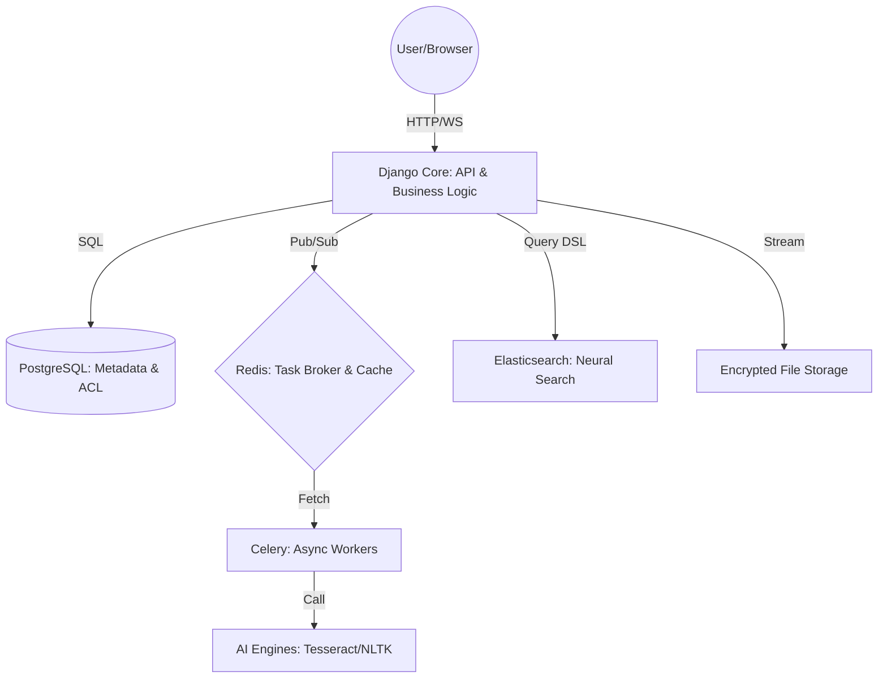
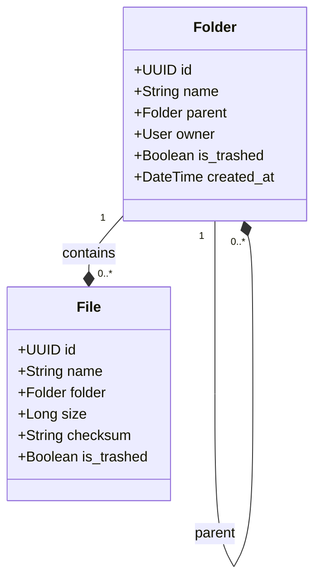
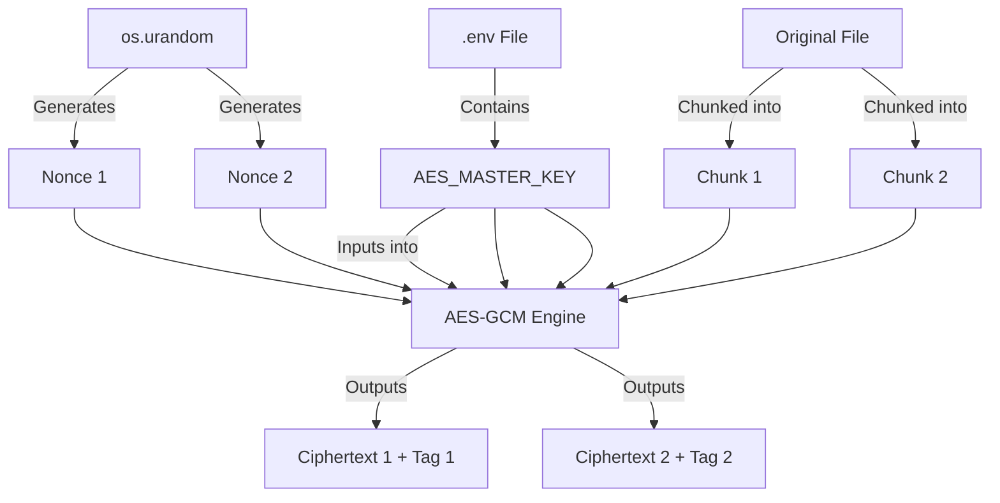
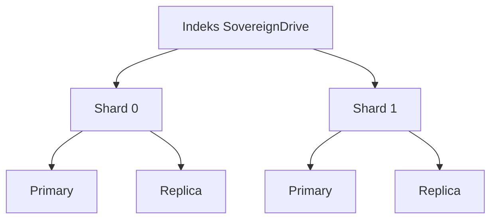
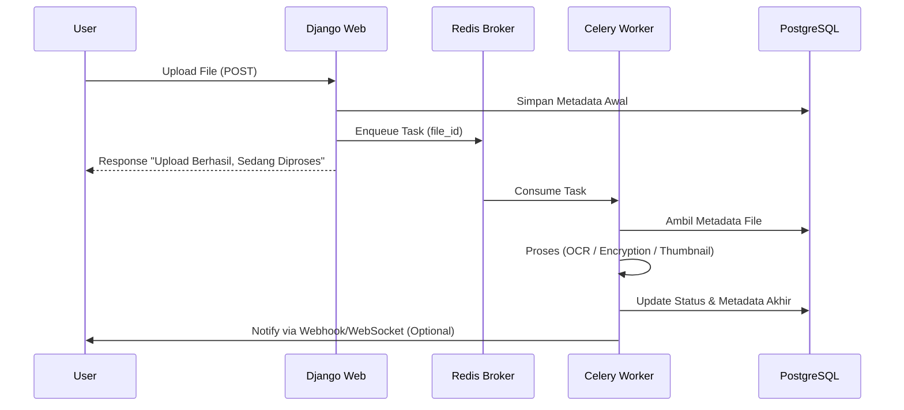
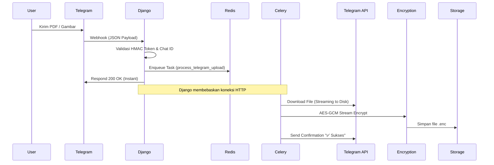
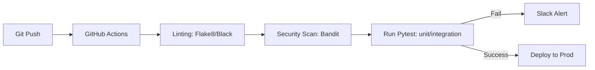

# Halaman Hak Cipta

**SovereignDrive: Membangun Cloud Pribadi Berbasis AI**
*Panduan Engineering Python, Django, dan Kriptografi*

Copyright © 2026 oleh **Andi Liani**.

Seluruh hak cipta dilindungi undang-undang. Dilarang mengutip atau memperbanyak sebagian atau seluruh isi buku ini dalam bentuk apa pun (seperti cetak, fotokopi, mikrofilm, VCD, CD-ROM, rekaman suara, dan softcopy file) tanpa izin tertulis dari penulis atau penerbit.

**Sanksi Pelanggaran Pasal 113**
*Undang-Undang Nomor 28 Tahun 2014 tentang Hak Cipta*
1. Setiap Orang yang dengan tanpa hak melakukan pelanggaran hak ekonomi sebagaimana dimaksud dalam Pasal 9 ayat (1) huruf i untuk Penggunaan Secara Komersial dipidana dengan pidana penjara paling lama 1 (satu) tahun dan/atau pidana denda paling banyak Rp100.000.000 (seratus juta rupiah).
2. Setiap Orang yang dengan tanpa hak dan/atau tanpa izin Pencipta atau pemegang Hak Cipta melakukan pelanggaran hak ekonomi Pencipta sebagaimana dimaksud dalam Pasal 9 ayat (1) huruf c, huruf d, huruf f, dan/atau huruf h untuk Penggunaan Secara Komersial dipidana dengan pidana penjara paling lama 3 (tiga) tahun dan/atau pidana denda paling banyak Rp500.000.000 (lima ratus juta rupiah).

---

**Diterbitkan pertama kali oleh:**
[Nama Penerbit Anda, misal: Sovereign Media Press]
Jakarta, Indonesia

**Penulis:** Andi Liani

---

*Buku ini dicetak di Indonesia.*
*Cetakan Pertama, 2026*
# Author Notes & Writing Strategy: SovereignDrive AI

## 🎯 Target & Goals
- **Target Halaman:** 500+ Halaman.
- **Audience:** Senior Engineer, DevOps, Security Researchers.
- **Tone:** Professional, Engineering-focused, authoritative yet accessible.

## 📈 Strategy "Eksploitasi Halaman" (Materi Berkualitas)
1.  **Deep Dive Bedah Kode:** Jangan hanya tampilkan kode, tapi jelaskan baris demi baris (Line-by-Line Analysis).
2.  **Anatomi Data:** Tampilkan contoh JSON, struktur header file (Magic Bytes), dan mapping database.
3.  **Common Pitfalls:** Tambahkan seksi "Kesalahan Umum" di setiap akhir bab.
4.  **Troubleshooting:** Berikan skenario error dan cara memperbaikinya.
5.  **Perbandingan Teknologi:** Bandingkan metode yang dipilih dengan alternatifnya (misal: AES-GCM vs AES-CBC).
6.  **Visualisasi:** Gunakan diagram Mermaid.js yang kompleks untuk menjelaskan alur data.

## 🛠️ To-Do List Reorganisasi
- [ ] Gabungkan BAB 1: Pendahuluan & Install.
- [ ] Gabungkan BAB 3: Kriptografi & Deep Dive.
- [ ] Gabungkan BAB 4: AI Indexing & Deep Dive.
- [ ] Gabungkan BAB 5: Elasticsearch & Deep Dive.
- [ ] Gabungkan BAB 6: Celery & Deep Dive.
- [ ] Gabungkan BAB 7: Telegram, Visual Alur, & Deep Dive.
- [ ] Gabungkan BAB 8: Produksi & Deep Dive.
- [ ] Gabungkan BAB 9: Mobile & Deep Dive.
- [ ] Tambahkan Bab 10: Testing & Security Audit (The Shield).
- [ ] Tambahkan Glosarium di akhir buku.
# Bab 0: Dunia Open Source dan Keajaiban Ubuntu

## 0.1. Mengapa Kita Di Sini? (Gerakan Open Source)
Sebelum kita menyentuh baris kode pertama atau mengonfigurasi server, kita perlu memahami fondasi di mana semua teknologi ini berdiri. Kita hidup di era di mana perangkat lunak bukan lagi sekadar alat, melainkan infrastruktur peradaban. 

**Open Source** (Sumber Terbuka) bukan hanya soal "gratis". Ini adalah tentang kebebasan, kolaborasi global, dan transparansi. Bayangkan jika resep obat paling mujarab di dunia dirahasiakan oleh satu perusahaan; dunia akan menderita. Perangkat lunak pun demikian. Dengan Open Source, siapa pun dapat melihat, memperbaiki, dan menyebarkan kode tersebut untuk kebaikan bersama.

### 0.1.1. Mengapa Harus Open Source?
1. **Keamanan Melalui Transparansi:** Karena kodenya terbuka, ribuan mata mengawasinya. Bug dan celah keamanan ditemukan dan diperbaiki lebih cepat dibandingkan perangkat lunak tertutup (proprietary).
2. **Tanpa Ketergantungan Vendor (No Vendor Lock-in):** Anda memiliki kendali penuh. Jika satu penyedia layanan berhenti mendukung aplikasi Anda, Anda bisa memindahkannya ke tempat lain.
3. **Inovasi Cepat:** Standar teknologi dunia (seperti internet) dibangun di atas protokol open source.

---

## 0.2. Ubuntu: Linux untuk Semua Orang
Dari ratusan distribusi Linux yang ada, mengapa kita memilih Ubuntu? Kata "Ubuntu" sendiri berasal dari bahasa Afrika kuno yang berarti **"Kemanusiaan untuk sesama"** (*I am because we are*). 

Filosofi ini dibawa ke dunia digital oleh Mark Shuttleworth dan Canonical. Ubuntu dirancang agar Linux tidak lagi menakutkan bagi orang awam.

### 0.2.1. Ubuntu Desktop vs Ubuntu Server
Dalam buku ini, kita akan sering bersinggungan dengan kedua dunia ini:
- **Ubuntu Desktop (GUI):** Memiliki antarmuka grafis yang ramah pengguna. Cocok bagi pemula untuk mulai mengenal Linux, instalasi aplikasi melalui "Software Center", dan manajemen file secara visual.
- **Ubuntu Server (CLI):** Versi "murni" tanpa antarmuka grafis. Inilah mesin pacu yang akan menjalankan aplikasi SovereignDrive kita di dunia nyata. Ia ringan, stabil, dan sangat efisien karena tidak menghabiskan sumber daya RAM untuk tampilan visual yang tidak perlu di server.

### 0.2.2. Kapan Menggunakan Ubuntu Server?
Ubuntu Server adalah pilihan utama ketika Anda ingin membangun:
1. **Web Server:** Menjalankan aplikasi Python/Django.
2. **Database Server:** Menyimpan jutaan data dengan aman.
3. **Cloud Pribadi:** Menjadi pusat penyimpanan data mandiri.

---

## 0.3. Dukungan Perangkat Keras (Hardware)
Salah satu keunggulan Ubuntu adalah dukungan perangkat kerasnya yang sangat luas. Anda tidak perlu komputer terbaru seharga puluhan juta untuk menjalankan sistem yang kita bahas di buku ini.

- **Komputer Tua/Laptop Bekas:** Anda bisa membangkitkan kembali laptop lama Anda menjadi server rumahan yang tangguh.
- **Raspberry Pi:** Komputer mungil seukuran kartu kredit pun bisa menjalankan Ubuntu Server.
- **Cloud/VPS:** Layanan seperti DigitalOcean, AWS, atau Google Cloud semuanya menempatkan Ubuntu sebagai pilihan utama.
- **Arsitektur Modern:** Mendukung x86 (Intel/AMD) hingga ARM (seperti MacBook M1/M2/M3 atau HP modern).

---

## 0.4. Perjalanan Menuju Kedaulatan Digital
Memilih Open Source dan Ubuntu adalah langkah pertama Anda menuju **Kedaulatan Digital**. Anda bukan lagi sekadar pengguna yang didikte oleh algoritma perusahaan besar, melainkan seorang kreator yang memegang kunci benteng datanya sendiri.

Mari kita lanjutkan ke persiapan teknis di Bab selanjutnya.
# Bab 1: Pondasi & Filosofi: Mengapa Harus Cloud Berdaulat?

## Cerita Di Balik Layar
Pada tahun 2021, dunia dikejutkan oleh kebocoran data dari beberapa penyedia layanan cloud raksasa. Jutaan foto pribadi, dokumen bisnis, dan identitas bocor ke forum peretas. Bagi sebagian orang, itu adalah bencana. Bagi seorang *Engineer*, itu adalah panggilan untuk bangun. Kita sadar bahwa "Cloud" sebenarnya hanyalah "Komputer milik orang lain". 

SovereignDrive AI lahir dari satu filosofi sederhana: **Kedaulatan Data (Data Sovereignty)**. Jika data adalah minyak baru, maka Anda harus memiliki kilang dan brankasnya sendiri. Bab ini akan memandu Anda memahami arsitektur dasar untuk merebut kembali kendali atas data Anda dan menyiapkan laboratorium pengembangan dengan standar industri.

---

## 1.1. Krisis Privasi di Era Digital

### 1.1.1. Sisi Gelap Penyimpanan Cloud Publik
Layanan gratis selalu datang dengan harga tersembunyi: privasi Anda. Cloud publik menggunakan algoritma untuk memindai foto Anda demi melatih AI mereka, atau menyajikan iklan yang ditargetkan. Selain itu, enkripsi yang mereka gunakan seringkali memiliki "pintu belakang" (*backdoor*) atau kuncinya dipegang oleh mereka, bukan Anda.

**Krisis dalam Angka:**
- Lebih dari **80%** perusahaan global menyimpan data sensitif di cloud publik.
- **60%** dari kebocoran data disebabkan oleh salah konfigurasi pada infrastruktur cloud pihak ketiga.
- Biaya rata-rata kebocoran data mencapai **$4.45 juta** per insiden pada tahun 2023.

### 1.1.2. Konsep Self-Sovereignty (Kedaulatan Data)
SovereignDrive mengadopsi pendekatan *Zero-Trust*. Sistem dirancang dengan asumsi bahwa server bisa saja diretas, tetapi peretas tidak akan mendapatkan apa-apa selain data acak (*ciphertext*). 

**Tiga Pilar Kedaulatan:**
1.  **Ownership (Kepemilikan):** Data fisik berada di bawah kendali Anda (Server lokal atau VPS milik sendiri).
2.  **Encryption (Enkripsi):** Kunci utama tidak pernah meninggalkan perangkat Anda atau server rahasia Anda.
3.  **Auditability (Dapat Diaudit):** Setiap baris kode sistem transparan dan dapat Anda audit sendiri.

---

## 1.2. Arsitektur SovereignDrive AI

Untuk membangun benteng ini, kita tidak menggunakan satu bahasa pemrograman, melainkan sebuah simfoni teknologi yang saling berkomunikasi melalui protokol standar.



### 1.2.1. Komponen Utama & Interaksinya
1. **Django (Python)**: Bertindak sebagai *Orchestrator*. Ia mengelola sesi pengguna, validasi izin (ACL), dan menjadi jembatan antar layanan.
2. **PostgreSQL**: Database relasional yang menyimpan struktur folder rekursif. Mengapa bukan NoSQL? Karena integritas data dan relasi antar folder sangat krusial dalam sistem file.
3. **Redis**: Sistem saraf pusat. Selain sebagai cache, ia adalah *Message Broker* yang menyimpan antrean tugas berat agar Django tidak terbebani.
4. **Elasticsearch**: Mata elang. Digunakan karena kemampuannya melakukan *Full-Text Search* pada jutaan dokumen dalam hitungan milidetik, sesuatu yang tidak bisa dilakukan SQL secara efisien.

### 1.2.2. Mengapa Python 3.12?
Python dipilih bukan hanya karena Django, tetapi karena efisiensi memori dan dukungan *Typing* yang lebih baik di versi 3.12. Ekosistem AI seperti Tesseract dan NLTK memiliki *wrapper* Python yang paling matang, memungkinkan kita mengintegrasikan kecerdasan buatan ke dalam penyimpanan data dengan sangat mudah.

---

## 1.3. Persiapan Lab Pengembangan (Infrastruktur)

Kita akan membangun laboratorium yang *reproducible* (dapat direplikasi). Artinya, setup di laptop Anda harus identik dengan setup di server produksi.

### 1.3.1. Keamanan Akses: Sovereign License Gatekeeper
Sebelum memulai, SovereignDrive AI menerapkan sistem **License Gatekeeper**. Ini adalah mekanisme perlindungan intelektual yang memastikan aplikasi hanya berjalan jika memiliki kunci lisensi yang sah. 

Dalam `core/settings.py`, kita mengimplementasikan pengecekan saat startup:
```python
SOVEREIGN_LICENSE_KEY = config('SOVEREIGN_LICENSE_KEY', default='')
if not SOVEREIGN_LICENSE_KEY:
    import sys
    print("ERROR: SOVEREIGN_LICENSE_KEY TIDAK DITEMUKAN!")
    sys.exit(1)
```
*Engineering Note:* Menggunakan `sys.exit(1)` saat startup adalah praktik "Fail Fast"—mencegah aplikasi berjalan dalam kondisi yang tidak terdefinisi atau tidak sah.

### 1.3.2. Modern Tooling: Migrasi ke `uv`
Meskipun `pip` adalah standar, di buku ini kita akan mengenal **`uv`**. Ini adalah paket manajer Python yang ditulis dalam Rust, yang **10x lebih cepat** daripada pip dan pip-tools. 

**Instalasi `uv`:**
- **Linux/macOS:** `curl -LsSf https://astral.sh/uv/install.sh | sh`
- **Windows:** `powershell -c "irm https://astral.sh/uv/install.ps1 | iex"`

### 1.3.3. Automasi Jaringan: Get Docker IP
Salah satu masalah klasik di Docker adalah perubahan IP container. SovereignDrive memecahkannya dengan fungsi pembantu `get_docker_ip()` yang melakukan inspeksi ke socket Docker secara otomatis untuk menemukan host database dan cache:

```python
def get_docker_ip(container_name, default='127.0.0.1'):
    try:
        result = subprocess.run(
            ['docker', 'inspect', '-f', '{{range.NetworkSettings.Networks}}{{.IPAddress}}{{end}}', container_name],
            capture_output=True, text=True, check=True, timeout=2
        )
        return result.stdout.strip() or default
    except Exception:
        return default
```

### 1.3.4. Docker: Kontainerisasi Layanan Pendukung
Kita tidak akan menginstal PostgreSQL atau Elasticsearch langsung di OS. Kita akan menggunakan Docker untuk membungkusnya.

**File `docker-compose.yml` Dasar:**
```yaml
services:
  db:
    image: postgres:16
    environment:
      POSTGRES_DB: awan_db
      POSTGRES_PASSWORD: secretpassword
  redis:
    image: redis:7-alpine
  elasticsearch:
    image: elasticsearch:8.11.1
    environment:
      - discovery.type=single-node
      - xpack.security.enabled=false
```

---

## 1.4. Identitas & Autentikasi Modern (SSO)

Di era modern, memaksa pengguna menghafal password baru adalah sebuah hambatan. SovereignDrive mendukung **SSO (Single Sign-On)** menggunakan protokol OAuth2 melalui library `social-auth-app-django`.

### 1.4.1. Integrasi Google & Microsoft Azure
Sistem telah dikonfigurasi untuk menerima identitas dari penyedia raksasa. Hal ini penting untuk tingkat perusahaan (*Enterprise Readiness*).
- **Social Auth Pipeline**: Proses otomatis yang memetakan data dari Google/Azure (Email, Nama, Foto) langsung ke model User Django tanpa campur tangan manual.

---

## 1.5. The Sovereign Manifesto (12 Prinsip Utama)

Sebelum menulis baris kode pertama, kita harus menyepakati prinsip-prinsip ini agar sistem tetap aman:
1. **Zero Access by Default**: Tidak ada data yang bisa diakses tanpa token yang sah.
2. **Never Trust the Client**: Validasi semua input, termasuk ukuran dan tipe file.
3. **Stream Everything**: Jangan pernah memuat file besar ke RAM.
4. **Encrypt at Rest**: File di disk harus selalu dalam keadaan terenkripsi.
5. **Decouple Secrets**: Jangan simpan kunci enkripsi di database yang sama.
6. **Async by Nature**: Proses berat (OCR/Enkripsi) harus berjalan di background.
7. **Audit Every Move**: Catat setiap aksi krusial (hapus/unduh).
8. **Fail Securely**: Jika sistem error, ia harus menutup akses, bukan membukanya.
9. **No Hardcoding**: Semua konfigurasi sensitif ada di `.env`.
10. **Test the Fortress**: Sistem tanpa automated test adalah sistem yang rapuh.
11. **License Integrity**: Selalu gunakan kunci lisensi yang valid.
12. **SSO First**: Utamakan login terpusat untuk keamanan audit yang lebih baik.

---

## 1.5. Langkah Menjalankan Proyek (Standard Operating Procedure)

1.  **Clone & Setup**: 
    ```bash
    uv venv
    source .venv/bin/activate
    uv pip install -r requirements.txt
    ```
2.  **Environment Configuration**: Salin `.env.example` menjadi `.env` dan sesuaikan kunci rahasia Anda.
3.  **Boot Infrastructure**: `docker-compose up -d`.
4.  **Database Health Check**: Pastikan migrasi berjalan lancar dengan `python manage.py migrate`.
5.  **Verify Services**: Jalankan skrip `check_infra.sh` (tersedia di root proyek) untuk memastikan Redis dan ES merespons.

---

## 1.6. Common Pitfalls & Troubleshooting
- **Conflict Virtualenv**: Jika menggunakan `uv`, pastikan Anda tidak mencampuradukkannya dengan `pip` global untuk menghindari kebingungan *interpreter*.
- **Docker Port Conflict**: Jika port 5432 atau 6379 sudah terpakai oleh aplikasi lain di laptop Anda, ubah pemetaan port di `docker-compose.yml`.
- **ES Heap Size**: Elasticsearch bisa sangat rakus RAM. Jika ia gagal berjalan di laptop dengan RAM 8GB, tambahkan batasan memori di docker-compose: `ES_JAVA_OPTS=-Xms512m -Xmx512m`.

---

## ✅ Engineering Checkpoint: Pondasi & Infrastruktur
Sebelum melangkah ke arsitektur data yang lebih kompleks, pastikan laboratorium pengembangan Anda telah memenuhi standar berikut:
- [ ] **Arsitektur Client-Server:** Sudahkah Anda memahami bagaimana Django berinteraksi dengan database dan cache eksternal?
- [ ] **Environment Isolation:** Apakah Anda sudah menggunakan `uv` atau `venv` dan tidak menginstal library secara global?
- [ ] **Infrastructure-as-Code (Docker):** Apakah seluruh layanan pendukung (Postgre, Redis, ES) sudah berjalan secara stabil via Docker Compose?
- [ ] **Service Verification:** Apakah skrip pengecekan infra (`check_infra.sh`) mengembalikan status hijau untuk semua layanan?
- [ ] **Django MVT Mastery:** Apakah Anda sudah familiar dengan alur data dari Model ke View hingga dirender ke Template?
# Bab 2: Arsitektur Database & Hirarki Folder

## Cerita Di Balik Layar
Pernahkah Anda mencoba memindahkan folder yang berisi 10.000 file ke dalam folder lain? Pada sistem operasi yang buruk, proses ini bisa memakan waktu bermenit-menit. Namun, pada sistem yang efisien, proses ini terjadi dalam kedipan mata. Rahasianya ada pada bagaimana data tersebut dimodelkan di dalam database. 

Dalam bab ini, kita akan membongkar desain *schema* database SovereignDrive AI. Kita akan belajar bagaimana menyimpan miliaran file dan folder tanpa membuat database PostgreSQL kita "tersedak", serta bagaimana membangun sistem izin akses yang kompleks namun tetap cepat.

---

## 2.1. Pemodelan Hirarki: Adjacency List vs Path Enumeration

Sistem file di komputer Anda berbentuk pohon (Tree). Dalam dunia database, ada beberapa cara untuk menyimpan struktur pohon.

### 2.1.1. Adjacency List (Relasi Rekursif)
SovereignDrive menggunakan metode **Adjacency List**. Setiap folder menyimpan referensi ke "orang tua"-nya (`parent_id`). 



**Kelebihan:**
- **Instan Move:** Memindahkan folder (beserta seluruh isinya) hanya membutuhkan satu operasi SQL `UPDATE parent_id`. Ini sangat efisien.
- **Integritas:** Mudah untuk menjaga konsistensi data menggunakan *Foreign Key* bawaan database.

### 2.1.2. Tantangan: Mendapatkan "Full Path"
Kelemahan Adjacency List adalah saat kita ingin menampilkan *Breadcrumbs* (jalur lengkap folder, misal: `Home > Dokumen > Rahasia > Proyek A`). SQL harus melakukan query berulang kali (rekursif) ke atas untuk menemukan kakek, buyut, hingga akar folder. 

**Solusi SovereignDrive:** Kita menyimpan metadata tambahan atau menggunakan fitur **Recursive Common Table Expressions (CTE)** di PostgreSQL untuk menarik seluruh jalur dalam satu query tunggal yang sangat cepat.

---

## 2.2. Keamanan di Level Skema

### 2.2.1. UUIDv4 sebagai Primary Key
Jangan pernah menggunakan ID integer (1, 2, 3...) untuk entitas yang bisa diakses publik.
**Alasan Engineering:**
1.  **Anti-Enumeration:** Peretas tidak bisa menebak ID file lain.
2.  **Distributed Systems:** Jika Anda memiliki banyak server database (Sharding), UUID menjamin tidak akan ada konflik ID antar server.

### 2.2.2. Checksum (Digital Fingerprint)
Model `File` kita memiliki field `checksum` (SHA-256). 
- **Fungsi:** Memastikan integritas data. Jika data di disk berubah karena kerusakan hardware, checksum database tidak akan cocok.
- **De-duplication:** Jika dua user mengunggah file yang sama persis, kita bisa mendeteksinya via checksum dan menghemat penyimpanan (opsional).

---

## 2.3. Logika Navigasi & Optimasi Query

### 2.3.1. Masalah N+1 Query
Bayangkan Anda memiliki 100 file dalam satu folder. Jika Anda memanggil `file.owner.username` di dalam loop tanpa optimasi, Django akan melakukan 100 query tambahan ke tabel User. 

### 2.3.2. Senjata Rahasia: select_related & prefetch_related
- **`select_related('owner', 'folder')`**: Melakukan *SQL JOIN*. Gunakan ini untuk hubungan 1-ke-1 atau Banyak-ke-1.
- **`prefetch_related('accesses')`**: Melakukan query terpisah lalu menggabungkannya di Python. Gunakan ini untuk hubungan Banyak-ke-Banyak (seperti daftar user yang punya akses ke file tersebut).

---

## 2.4. Manajemen Quota & User Profile

SovereignDrive harus membatasi berapa banyak data yang bisa disimpan pengguna. Kita tidak menghitung total ukuran file setiap kali user mengunggah sesuatu (itu terlalu lambat).

### 2.4.1. Denormalisasi Kuota
Kita menyimpan `storage_used` di dalam model `UserProfile`. 
```python
class UserProfile(models.Model):
    user = models.OneToOneField(User, on_delete=models.CASCADE)
    storage_limit = models.BigIntegerField(default=15*1024*1024*1024) # 15GB
    storage_used = models.BigIntegerField(default=0)
```

### 2.4.2. Race Condition pada Kuota
Jika pengguna mengunggah dua file secara bersamaan dalam milidetik yang sama, kedua proses mungkin membaca nilai `storage_used` yang sama sebelum salah satunya mengupdate. Ini disebut **Race Condition**.
**Solusinya:** Gunakan `F()` expressions di Django:
`profile.storage_used = F('storage_used') + new_file_size`
Ini memaksa database melakukan penjumlahan di level SQL, menjamin akurasi meskipun ada ribuan upload bersamaan.

---

## 2.5. Soft Delete (Trash Bin) Architecture

Kita tidak pernah benar-benar menghapus data saat user menekan tombol "Hapus". Kita hanya memindahkannya ke Keranjang Sampah.
- **Field `is_trashed`**: Boolean filter yang ada di hampir setiap model.
- **Manager Kustom**: Kita membuat Django Manager kustom agar query `File.objects.all()` secara otomatis hanya mengembalikan file yang TIDAK ada di sampah, kecuali jika diminta secara eksplisit.

---

## 2.6. Arsitektur Unggahan Skala Besar (Chunked Upload)

Bagaimana jika pengguna ingin mengunggah file video berukuran 10GB dengan koneksi internet yang tidak stabil? Mengunggah dalam satu permintaan HTTP tunggal adalah resep bencana. Jika koneksi terputus di 99%, pengguna harus mengulang dari nol.

SovereignDrive memecahkannya dengan model **`FileChunk`**.

### 2.6.1. Mekanisme Pemecahan File
File besar dipecah menjadi potongan kecil (misal: per 2MB) di sisi klien. Setiap potongan dikirim secara terpisah ke server.
- **`upload_id`**: Token UUID unik yang mengikat seluruh potongan file yang sama.
- **`total_chunks` vs `received_chunks`**: Server melacak progres unduhan. Hanya jika semua potongan sudah diterima, proses penggabungan (Assembly) dimulai.

### 2.6.2. Penyimpanan Sementara Potongan
Server menyimpan potongan file di direktori khusus (`/media/chunks/<upload_id>/`) sebelum digabungkan. Hal ini mencegah penggunaan memori RAM yang berlebihan karena potongan file langsung ditulis ke disk.

```python
class FileChunk(models.Model):
    upload_id = models.UUIDField(default=uuid.uuid4, unique=True, db_index=True)
    total_chunks = models.IntegerField()
    received_chunks = models.IntegerField(default=0)
    
    def get_chunk_path(self, chunk_index):
        directory = os.path.join(settings.MEDIA_ROOT, 'chunks', str(self.upload_id))
        os.makedirs(directory, exist_ok=True)
        return os.path.join(directory, f'part_{chunk_index}')
```

---

## 2.7. Common Pitfalls (Lubang Jebakan)

1.  **Circular References:** Apa yang terjadi jika Folder A adalah orang tua Folder B, dan Anda mencoba menjadikan Folder B sebagai orang tua Folder A? Anda menciptakan *Infinite Loop*. 
    *   **Solusi:** Selalu validasi hirarki di level Model `clean()` atau gunakan database trigger.
2.  **Missing DB Indexes:** Tanpa indeks pada field `parent` dan `owner`, mencari file di dalam folder yang berisi jutaan data akan memakan waktu berdetik-detik. Pastikan `db_index=True` terpasang.

---

## ✅ Engineering Checkpoint: Arsitektur Data & Optimasi
Pastikan desain database Anda siap menangani jutaan baris data dengan memverifikasi poin-poin berikut:
- [ ] **Recursive Integrity:** Apakah model `Folder` Anda sudah menangani relasi *self-referential* dengan benar?
- [ ] **ID Security:** Apakah seluruh model utama sudah menggunakan UUIDv4 untuk mencegah serangan IDOR?
- [ ] **Query Efficiency:** Sudahkah Anda menggunakan `select_related` untuk mematikan N+1 Query Problem pada metadata file?
- [ ] **Quota Reliability:** Apakah pembaruan kuota sudah menggunakan `F()` expressions atau `select_for_update` untuk mencegah *race condition*?
- [ ] **Trash Logic:** Apakah sistem *Soft Delete* (`is_trashed`) sudah terimplementasi secara konsisten di seluruh model?
- [ ] **Database Indexing:** Apakah indeks sudah terpasang pada field yang menjadi kunci pencarian dan filter?
# Bab 3: Kriptografi: Mengunci Gerbang Data

## Cerita Di Balik Layar
Bayangkan Anda memiliki brankas paling kuat di dunia, tetapi kuncinya Anda selipkan di bawah keset depan pintu. Itulah yang terjadi jika Anda membangun Cloud tanpa strategi enkripsi yang matang. Dalam bab ini, kita akan mempelajari bagaimana SovereignDrive AI memastikan bahwa bahkan administrator sistem atau peretas yang berhasil menembus server tidak akan bisa membaca satu bit pun data Anda tanpa kunci utama.

Kriptografi di SovereignDrive bukan sekadar "pemanis" fitur; ia adalah pondasi di mana seluruh sistem berdiri. Kita akan membedah dari teori matematika dasar AES-GCM hingga implementasi *Custom Storage Backend* di Django yang menangani enkripsi secara transparan.

---

## 3.1. Anatomi Keamanan: Mengapa AES-256 GCM?

Dalam dunia kriptografi simetris, terdapat berbagai "mode" operasi. Dua yang paling populer adalah CBC (Cipher Block Chaining) dan GCM (Galois/Counter Mode). 

### 3.1.1. Masalah pada AES-CBC
Banyak tutorial Django lama menyarankan penggunaan AES-CBC. Namun, CBC memiliki kelemahan fatal: ia tidak menjamin **Integritas**. Seorang peretas dapat memanipulasi bit tertentu dalam file terenkripsi (serangan *Bit Flipping*), dan sistem Anda akan mendekripsinya menjadi data yang salah tanpa menyadari bahwa file tersebut telah dimodifikasi.

### 3.1.2. Keunggulan AES-GCM (Authenticated Encryption)
SovereignDrive menggunakan **AES-256 GCM**. Ini adalah standar emas saat ini karena merupakan *Authenticated Encryption with Associated Data* (AEAD). 
1.  **Kerahasiaan (Confidentiality)**: Data Anda diubah menjadi ciphertext yang mustahil dibaca tanpa kunci.
2.  **Integritas & Autentikasi**: GCM menghasilkan sebuah "Authentication Tag" (16 byte). Jika peretas mengubah satu bit saja dalam file di disk, proses dekripsi akan gagal dengan error `InvalidTag`.
3.  **Performa Tinggi**: GCM dapat diparalelkan di level instruksi CPU (menggunakan instruksi `AES-NI`), sehingga proses enkripsi file 1GB hampir tidak terasa bebannya pada CPU modern.

---

## 3.2. Arsitektur Manajemen Kunci (Key Management)

Kesalahan pemula adalah menggunakan `SECRET_KEY` Django sebagai kunci enkripsi. Jika server Anda diretas dan Anda harus mengganti `SECRET_KEY`, tiba-tiba Anda kehilangan akses ke semua file Anda selamanya karena data tidak lagi bisa didekripsi dengan kunci baru.

### 3.2.1. Key Decoupling Strategy
Kita memisahkan tanggung jawab kunci menjadi tiga lapis:
1.  **Django SECRET_KEY**: Hanya untuk session, cookies, dan signing internal Django.
2.  **AES_MASTER_KEY**: Kunci 256-bit (32 karakter) yang disimpan di environment variable (`.env`) khusus untuk data.
3.  **Per-File Nonce**: Setiap potongan file (chunk) memiliki "Nonce" (Number Used Once) acak 12-byte. Ini memastikan bahwa meskipun Anda mengunggah 10 file yang isinya identik, hasil ciphertext di disk akan 100% berbeda.

### 3.2.2. Visualisasi Hirarki Kunci


---

## 3.3. Implementasi Streaming Encryption (The Deep Dive)

Memproses file besar (misal: video 4K berukuran 5GB) di server dengan RAM terbatas (misal: VPS 1GB) adalah tantangan engineering. Kita tidak bisa membaca seluruh file ke memori.

### 3.3.1. Teknik Chunking & Generators
Kita menggunakan fitur **Generator** di Python (`yield`) untuk membuat "pipa" data. Data mengalir dari input, dienkripsi 64KB demi 64KB, dan langsung dikirim ke penyimpanan.

### 3.3.2. Bedah Struktur Byte di Disk (.enc)
Format file SovereignDrive di penyimpanan tidak sembarangan. Ia memiliki struktur header khusus yang memungkinkan sistem melakukan verifikasi instan:

| Offset | Ukuran | Nama | Deskripsi |
| :--- | :--- | :--- | :--- |
| 0 | 12 Byte | **Magic Header** | String `AWAN_AESGCM\x00` untuk identitas file. |
| 12 | 4 Byte | **Chunk Length** | Panjang data terenkripsi (Little-Endian). |
| 16 | 12 Byte | **Nonce** | Angka acak unik untuk chunk ini. |
| 28 | Variabel | **Ciphertext** | Data asli yang sudah terenkripsi + 16 byte Auth Tag. |

*Engineering Detail:* Kita menggunakan **Little-Endian** (`<I` pada `struct.pack`) agar metadata file tetap konsisten saat dipindahkan antar arsitektur CPU (seperti dari server Intel ke laptop ARM MacBook M1).

---

## 3.4. Proses Dekripsi: Membongkar Paket Biner

Jika enkripsi adalah proses "membungkus", maka dekripsi adalah seni "membongkar" tanpa merusak isinya. Perhatikan bagaimana fungsi `decrypt_stream` bekerja di balik layar:

```python
def decrypt_stream(input_stream):
    # [1] Validasi Magic Header
    header = input_stream.read(12)
    if header != STREAM_MAGIC_HEADER:
        raise ValueError("File korup atau bukan format SovereignDrive!")

    key = get_aesgcm_key()
    aesgcm = AESGCM(key)

    while True:
        # [2] Membaca Panjang Chunk (4 byte)
        len_bytes = input_stream.read(4)
        if not len_bytes: break
        chunk_len = struct.unpack('<I', len_bytes)[0]
        
        # [3] Membaca Nonce (12 byte)
        nonce = input_stream.read(12)
        
        # [4] Membaca Ciphertext sesuai panjang yang disimpan
        encrypted_chunk = input_stream.read(chunk_len)
        
        # [5] Dekripsi & Validasi Tag Autentikasi
        try:
            yield aesgcm.decrypt(nonce, encrypted_chunk, None)
        except Exception:
            raise ValueError("Integritas data gagal: File telah dimodifikasi!")
```

**Analisis Teknikal:**
- **`struct.unpack('<I', len_bytes)`**: Kita menggunakan Little-Endian (`<`) untuk memastikan file bisa dibaca di berbagai arsitektur CPU (Intel, ARM, dll) dengan konsisten.
- **`try...except`**: Inilah letak kekuatan AES-GCM. Jika satu bit saja dalam `encrypted_chunk` berubah, fungsi `decrypt` akan melempar *exception*. Kita tidak hanya mendekripsi, tapi juga melakukan audit keamanan secara *real-time*.

---

## 3.5. Advanced Engineering: Custom Django Storage Backend

Agar pengembang aplikasi tidak perlu memikirkan enkripsi setiap kali memanggil `file.save()`, kita akan mengintegrasikan logika ini ke dalam sistem internal Django.

### 3.5.1. EncryptedStreamWrapper: Sang Jembatan
Django mengharapkan objek file yang memiliki metode `.read()`. Namun, generator kita (`encrypt_stream`) hanya memiliki metode `next()`. Kita butuh *wrapper* untuk mengubah generator menjadi file virtual.

```python
class EncryptedStreamWrapper:
    def __init__(self, generator):
        self.gen = generator
        self.buffer = b''

    def read(self, size=-1):
        while size == -1 or len(self.buffer) < size:
            try:
                self.buffer += next(self.gen)
            except StopIteration:
                break
        
        # Kirim data sesuai ukuran yang diminta Django
        chunk, self.buffer = self.buffer[:size], self.buffer[size:]
        return chunk
```

### 3.5.2. Implementasi Custom Storage
Dengan mewarisi `FileSystemStorage`, kita bisa melakukan *intercept* pada proses tulis dan baca.

```python
class EncryptedFileSystemStorage(FileSystemStorage):
    def _save(self, name, content):
        # Enkripsi otomatis saat user mengunggah file
        wrapped_content = EncryptedStreamWrapper(encrypt_stream(content))
        return super()._save(name, wrapped_content)

    def open(self, name, mode='rb'):
        # Dekripsi otomatis saat file dibuka oleh aplikasi
        raw_file = super().open(name, mode)
        if 'b' in mode:
            return DecryptedStreamWrapper(decrypt_stream(raw_file))
        return raw_file
```

---

## 3.6. Keamanan Kunci di Produksi: HashiCorp Vault & KMS

Untuk aplikasi level korporat, menyimpan `AES_MASTER_KEY` di file `.env` masih dianggap berisiko tinggi (karena file `.env` sering tidak sengaja terbawa ke backup atau log server).

### 3.6.1. Penggunaan External KMS
SovereignDrive dirancang agar bisa menggunakan **Key Management Service (KMS)** eksternal seperti **HashiCorp Vault** atau **AWS KMS**.
- Alur: Django meminta "Kunci Data" ke Vault saat startup.
- Keuntungan: Kunci utama tidak pernah ada di disk server aplikasi. Jika server diretas, peretas tidak akan menemukan kunci enkripsi di sana.

### 3.6.2. Strategi Rotasi Kunci (Versioning)
Kita menggunakan **Magic Header Versioning**. 
- Header `AWAN_V1`: Menggunakan kunci lama.
- Header `AWAN_V2`: Menggunakan kunci baru.
Sistem dapat mengenali versi header dan memilih kunci yang tepat dari *Key History* secara otomatis.

---

## 3.7. Common Pitfalls (Lubang Jebakan)

1.  **Nonce Collision**: Menggunakan Nonce yang sama untuk dua data berbeda. Ini adalah "dosa besar" dalam AES-GCM yang bisa membocorkan kunci. Selalu gunakan `os.urandom(12)`.
2.  **Lack of Authentication Tag Verification**: Mengabaikan error saat dekripsi. Jika dekripsi gagal, **jangan pernah** menampilkan data yang terpotong ke user; itu bisa menjadi celah keamanan.
3.  **Storing IV in Database**: Beberapa orang menyimpan IV/Nonce di database SQL. Ini tidak perlu jika Anda menggunakan struktur biner SovereignDrive yang menyisipkan Nonce di dalam file itu sendiri.

---

## ✅ Engineering Checkpoint: Keamanan & Kriptografi
Keamanan data adalah harga mati. Pastikan benteng kriptografi Anda telah memenuhi standar industri:
- [ ] **Authenticated Encryption:** Apakah Anda sudah menggunakan AES-256 GCM untuk menjamin kerahasiaan sekaligus integritas data?
- [ ] **Cryptographic Nonce:** Apakah setiap chunk file sudah menggunakan Nonce unik hasil dari `os.urandom(12)`?
- [ ] **Binary Unpacking Integrity:** Apakah fungsi dekripsi sudah memvalidasi *Magic Header* dan *Authentication Tag* secara ketat?
- [ ] **Transparent Automation:** Apakah enkripsi sudah diintegrasikan ke dalam *Custom Storage Backend* menggunakan `StreamWrapper`?
- [ ] **Memory Safety:** Apakah seluruh proses dilakukan secara streaming (64KB chunks) untuk mencegah lonjakan RAM (OOM)?
- [ ] **Secret Isolation:** Apakah kunci utama sudah dipisahkan dari `SECRET_KEY` Django dan dipersiapkan untuk integrasi KMS eksternal?
# Bab 4: Brain-Circuit: AI Indexing & OCR

## Cerita Di Balik Layar
Bayangkan Anda memiliki ribuan foto nota, dokumen PDF hasil scan, dan materi penting di dalam cloud Anda. Di cloud konvensional, Anda harus membuka file satu per satu secara manual karena komputer tidak tahu apa isi di dalam gambar tersebut. Data ini sering disebut sebagai **Dark Data**—data yang ada namun tidak bisa dimanfaatkan karena tidak dapat dicari.

Dalam bab ini, kita akan membangun "Mata Digital" untuk SovereignDrive. Kita akan membuat sistem yang secara otomatis membaca setiap piksel gambar, mengekstraksi teksnya, dan menyimpannya ke dalam memori cerdas server agar bisa dicari dalam hitungan milidetik. Inilah keunggulan utama yang membedakan SovereignDrive dari penyimpanan cloud biasa.

---

## 4.1. Membangun Pipeline Visi Komputer (OCR)

OCR (*Optical Character Recognition*) adalah teknologi yang menjembatani dunia fisik (piksel gambar) dengan dunia digital (teks terstruktur). Di jantung sistem ini, kita menggunakan **Tesseract OCR**, mesin berbasis *Neural Network* (LSTM) yang dikembangkan oleh Google.

### 4.1.1. Alur Kerja Ekstraksi Pintar
SovereignDrive tidak melakukan OCR secara buta. Kita membangun pipeline yang efisien:

```mermaid
graph TD
    A[File Terunggah] --> B{Cek Tipe File}
    B -- PDF Digital -- > C[Ekstraksi Teks via PyMuPDF]
    B -- Gambar / Scan --> D[Image Pre-processing]
    D --> E[Tesseract OCR Engine]
    C & E --> F[Teks Mentah]
    F --> G[NLP Pipeline: Cleansing]
    G --> H[Simpan ke DB & Elasticsearch]
```

### 4.1.2. Pre-processing: Memberi "Kacamata" pada AI
Tesseract seringkali gagal jika gambar terlalu buram, miring, atau memiliki latar belakang yang bising. Kita menggunakan **Pillow (PIL)** untuk melakukan normalisasi citra sebelum diproses:

1.  **Grayscale & Binarization**: Mengubah gambar menjadi hitam-putih murni. Ini menghilangkan gangguan warna dan memperjelas kontur huruf.
2.  **DPI Scaling**: Tesseract bekerja optimal pada resolusi 300 DPI. Kita secara otomatis mengubah ukuran gambar yang terlalu kecil agar karakter lebih mudah dikenali.
3.  **Noise Removal**: Menggunakan filter median untuk membuang bintik-bintik halus (salt and pepper noise) yang sering muncul pada dokumen hasil scan lama.

---

## 4.2. Natural Language Processing (NLP)

Mendapatkan teks dari gambar hanyalah separuh jalan. Teks hasil OCR seringkali mengandung kesalahan ketik atau kata-kata yang tidak berguna untuk pencarian.

### 4.2.1. Normalisasi & Cleansing
Kita membangun modul `TextPreprocessor` yang melakukan tugas-tugas berikut:
- **Case Folding**: Mengubah semua teks menjadi huruf kecil agar pencarian bersifat *case-insensitive*.
- **Regex Cleaning**: Membuang karakter non-alfanumerik yang sering muncul sebagai sampah hasil OCR (seperti `|`, `_`, atau `~`).

### 4.2.2. Lemmatization: Mencari Berdasarkan Makna
Mengapa mencari "makanan" juga harus memunculkan file berisi kata "makan"? 
Inilah gunanya **Lemmatization**. Berbeda dengan *Stemming* yang hanya memotong imbuhan secara kaku (misal: "mewarnai" menjadi "warna"), Lemmatization menggunakan kamus bahasa untuk mengembalikan kata ke bentuk dasarnya (Lemma) secara cerdas. 

Di SovereignDrive, kita mengintegrasikan NLTK dengan dukungan bahasa Indonesia untuk memastikan hasil pencarian tetap akurat meskipun kata yang dicari menggunakan imbuhan yang berbeda.

---

## 4.3. Bedah Kode: Arsitektur AI Hybrid Worker

Tugas AI adalah tugas yang sangat haus *resource* (CPU dan RAM). Jika dilakukan langsung di server web, aplikasi akan membeku. Kita menggunakan **Celery** untuk mengelola tugas-tugas ini secara asinkron.

### 4.3.1. Implementasi RAM-Friendly Indexing
Perhatikan strategi kita dalam menangani file besar di `storage/tasks/__init__.py`. Kita tidak memuat seluruh file ke memori, melainkan melakukan *streaming decryption* langsung ke file sementara di disk:

```python
@shared_task(bind=True, max_retries=3)
def process_file_and_index(self, file_id):
    # TAHAP 0: DEKRIPSI KE TEMPORARY FILE (RAM-Friendly)
    # NamedTemporaryFile memungkinkan library lain (fitz/PIL) membaca langsung dari disk
    with tempfile.NamedTemporaryFile(delete=True) as tmp_file:
        file_obj.file.seek(0)
        for chunk in decrypt_stream(file_obj.file):
            tmp_file.write(chunk)
        tmp_file.flush() # Pastikan semua data tertulis ke disk
        
        # TAHAP 1: EKSTRAKSI BERDASARKAN TIPE
        if ext.endswith('.pdf'):
            # Buka PDF dari path file sementara (Hemat RAM!)
            with fitz.open(tmp_file.name) as doc:
                text = "".join([p.get_text() for p in doc])
        else:
            # Buka Gambar dari path file sementara
            with Image.open(tmp_file.name) as img:
                text = pytesseract.image_to_string(img)
```

### **Analisis Engineering Tingkat Lanjut:**
1.  **Disk Buffering**: Dengan menulis ke disk sementara (`tmp_file.name`), kita bisa memproses file 100MB di server yang hanya memiliki sisa RAM 50MB.
2.  **Context Manager (`with`)**: Penggunaan `with` menjamin `tmp_file` akan dihapus dari disk segera setelah blok kode selesai, meskipun terjadi error di tengah proses.
3.  **Hybrid Engine**: Menggunakan `fitz` (PyMuPDF) karena ia mampu mengekstrak teks dari ribuan halaman PDF digital dalam hitungan detik tanpa membebani CPU seperti OCR.

---

## 4.4. Skalabilitas: Celery Task Prioritization

Tidak semua tugas AI memiliki prioritas yang sama. Di SovereignDrive, kita memisahkan antrean (queues):
- **Queue: `high_priority`**: Untuk pembuatan *thumbnail* agar user bisa langsung melihat pratinjau foto.
- **Queue: `ai_indexing`**: Untuk proses OCR dan NLP yang berat. 

Dengan pemisahan ini, ribuan dokumen yang sedang diindeks di latar belakang tidak akan mengganggu kecepatan sistem dalam memunculkan ikon gambar di dashboard pengguna.

---

## 4.5. Common Pitfalls (Lubang Jebakan)

1.  **Missing Tesseract Data**: Tesseract akan *crash* jika paket bahasa (`tessdata`) tidak ditemukan. Pastikan path `TESSDATA_PREFIX` sudah terkonfigurasi di environment server.
2.  **Encoding Nightmares**: Teks hasil OCR seringkali mengandung karakter non-UTF8. Selalu gunakan `.decode('utf-8', 'ignore')` atau `.encode('utf-8')` saat memproses string hasil ekstraksi.
3.  **Zombie Temporary Files**: Jika worker mati di tengah jalan, `NamedTemporaryFile` mungkin tidak terhapus. Selalu gunakan blok `try...finally` atau *context manager* (`with` statement) untuk menjamin kebersihan disk server.

---

## ✅ Engineering Checkpoint: AI Indexing & OCR
Mesin kecerdasan membutuhkan penanganan khusus agar tidak membebani resource server:
- [ ] **Hybrid Extraction Engine:** Apakah sistem sudah menggunakan `fitz` untuk PDF digital dan Tesseract hanya untuk gambar/scan?
- [ ] **Image Pre-processing:** Sudahkah Anda mengimplementasikan *binarization* dan *resizing* untuk meningkatkan akurasi OCR?
- [ ] **NLP Sanitization Pipeline:** Apakah teks sudah dibersihkan dari karakter sampah dan dilakukan *lemmatization* untuk akurasi pencarian?
- [ ] **Memory Protection:** Apakah proses ekstraksi menggunakan *disk buffering* (Temporary Files) untuk mencegah lonjakan RAM (OOM)?
- [ ] **Queue Separation:** Apakah tugas AI yang berat sudah dipisahkan ke dalam antrean Celery yang berbeda dari tugas ringan (seperti thumbnail)?
- [ ] **Multi-language Support:** Apakah Tesseract sudah dikonfigurasi untuk mendukung bahasa utama dokumen (Indonesian & English)?
# Bab 5: Elasticsearch: Pencarian Secepat Kilat

## Cerita Di Balik Layar
Menggunakan perintah `LIKE '%kata%'` di SQL untuk mencari teks di dalam jutaan dokumen sama seperti mencari satu kutipan spesifik di perpustakaan nasional dengan membaca buku satu per satu. Sangat lambat dan memakan resource tinggi karena database harus memindai setiap baris secara linear.

Di sinilah **Elasticsearch (ES)** masuk. Ia bukan database biasa; ia adalah mesin telusur terdistribusi yang dibangun di atas Apache Lucene. Ia menggunakan struktur **Inverted Index**, mirip dengan daftar indeks di halaman belakang sebuah buku ensiklopedia. Dalam bab ini, kita akan membangun "saraf pengingat" SovereignDrive yang mampu menemukan satu kata di antara jutaan halaman dokumen dalam hitungan milidetik.

---

## 5.1. Arsitektur Search Engine Terdistribusi

Elasticsearch dirancang untuk skala besar. Sebelum menulis kode, kita harus memahami bagaimana ia menyimpan data di balik layar.

### 5.1.1. Inverted Index: Rahasia Kecepatan
Dalam database relasional, data disimpan per baris (Row-based). Elasticsearch membaliknya. 

**Contoh Sederhana:**
- Dokumen 1: "Kopi pahit"
- Dokumen 2: "Kopi susu"

**Inverted Index:**
- "Kopi" -> [1, 2]
- "Pahit" -> [1]
- "Susu" -> [2]

Saat Anda mencari "Kopi", ES tidak memindai isi dokumen. Ia langsung melihat ke entri "Kopi" dan mendapatkan daftar ID dokumen [1, 2] seketika.

### 5.1.2. Shards dan Replicas
Untuk ketahanan data, ES membagi indeks menjadi beberapa **Shards** (potongan data).
- **Primary Shard**: Tempat data asli disimpan dan diproses.
- **Replica Shard**: Salinan data untuk berjaga-jaga jika server mati, sekaligus membantu mempercepat proses pencarian (Read Scalability).



---

## 5.2. Membangun Skema (Mapping) Cerdas

Di Elasticsearch, desain skema disebut **Mapping**. Kita harus menentukan tipe data yang tepat agar pencarian menjadi cerdas.

### 5.2.1. Text vs Keyword
- **`text`**: Digunakan untuk konten panjang (isi dokumen). Teks ini akan diurai (*analyzed*) menjadi kata-kata dasar.
- **`keyword`**: Digunakan untuk data yang harus sama persis (ID, Tag, Owner). Data ini tidak akan diurai.

### 5.2.2. Indonesian Analysis Pipeline
Salah satu fitur terkuat SovereignDrive adalah kemampuannya memahami Bahasa Indonesia. Kita menggunakan analyzer `indonesian` yang melakukan tiga tahap:
1.  **Character Filter**: Membersihkan karakter sampah (HTML, simbol).
2.  **Tokenizer**: Memecah kalimat menjadi kata (token).
3.  **Token Filter**: Membuang *stopwords* (di, ke, yang) dan melakukan *stemming* (mengubah "berlari" menjadi "lari").

---

## 5.3. Bedah Kode: Integrasi Django DSL

Kita menggunakan `django_elasticsearch_dsl` untuk mensinkronkan model `File` kita ke indeks Elasticsearch secara otomatis.

```python
# storage/documents.py
@registry.register_document
class FileDocument(Document):
    # [1] Multi-field: Mencari teks sekaligus filtering keyword
    name = fields.TextField(
        fields={'raw': fields.KeywordField()}
    )
    
    # [2] Analyzer Indonesia untuk hasil OCR
    extracted_text = fields.TextField(
        analyzer='indonesian',
        fields={'suggest': fields.CompletionField()} # Untuk Auto-complete
    )

    owner_id = fields.IntegerField()
    is_trashed = fields.BooleanField()

    class Index:
        name = 'sovereigndrive_files'
        settings = {'number_of_shards': 1, 'number_of_replicas': 0}
```

### 5.3.1. Query DSL: Search Relevance Engineering
Pencarian yang baik bukan hanya soal menemukan data, tapi menampilkan yang paling relevan di urutan teratas.

#### 5.3.2. Menjaga Urutan Relevansi di Django
Salah satu tantangan besar adalah saat kita mendapatkan ID file dari Elasticsearch (yang sudah terurut berdasarkan skor), namun saat melakukan query `File.objects.filter(id__in=ids)`, Django akan mengurutkannya kembali berdasarkan ID atau tanggal (kehilangan urutan relevansi ES).

SovereignDrive memecahkannya dengan teknik **`Case/When`** di PostgreSQL:

```python
from django.db.models import Case, When
# ids = [uuid_paling_relevan, uuid_kedua, ...]
preserved_order = Case(*[When(id=pk, then=pos) for pos, pk in enumerate(ids)])
files = File.objects.filter(id__in=ids).order_by(preserved_order)
```
Dengan teknik ini, urutan "kecerdasan" dari Elasticsearch tetap terjaga hingga sampai ke tangan pengguna.

---

## 5.4. Sinkronisasi Data & Performance Hardening

### 5.4.1. Asynchronous Indexing (Celery)
Jangan pernah melakukan sinkronisasi ke Elasticsearch di dalam siklus permintaan web (Request-Response). Jika server ES sedang sibuk atau lambat, user akan menunggu lama. 
**Solusi:** Gunakan Celery untuk mengirim data ke ES di latar belakang.

### 5.4.2. Linux System Tuning
Elasticsearch membutuhkan resource yang stabil. Di server produksi, Anda wajib melakukan konfigurasi berikut:
1.  **Virtual Memory**: `sysctl -w vm.max_map_count=262144`. Tanpa ini, ES akan crash saat mencoba melakukan indexing berat.
2.  **Heap Size**: Jangan biarkan ES menggunakan seluruh RAM. Atur `ES_JAVA_OPTS` agar menggunakan maksimal 50% dari total RAM server (misal: `-Xmx1g -Xms1g` untuk RAM 2GB).

---

## 5.5. Common Pitfalls (Lubang Jebakan)

1.  **Mapping Explosion**: Membuat terlalu banyak field dinamis di Elasticsearch. Ini bisa menghabiskan memori server. Selalu definisikan mapping secara eksplisit.
2.  **Split Brain**: Kondisi di mana cluster ES terbagi dua dan kehilangan konsistensi data. Hindari ini dengan mengonfigurasi `discovery.seed_hosts` dengan benar di Docker.
3.  **Near Real-Time (NRT)**: Elasticsearch tidak langsung menyimpan data ke disk (ada jeda *refresh* sekitar 1 detik). Jangan gunakan ES untuk data yang membutuhkan konsistensi instan (seperti saldo bank).

---

## ✅ Engineering Checkpoint: Search Engine Engineering
Pastikan fitur pencarian Anda memberikan hasil yang relevan dan cepat kepada pengguna:
- [ ] **Distributed Logic:** Apakah Anda sudah menentukan jumlah *Shards* dan *Replicas* sesuai kapasitas server?
- [ ] **Mapping Precision:** Sudahkah Anda memisahkan field `text` (untuk pencarian) dan `keyword` (untuk filtering)?
- [ ] **Linguistic Analysis:** Apakah *Indonesian Analyzer* sudah aktif untuk menangani morfologi bahasa Nusantara?
- [ ] **Relevance Boosting:** Apakah query pencarian sudah memberikan bobot lebih pada nama file dibanding isi dokumen?
- [ ] **Security Filtering:** Apakah setiap query pencarian sudah dipaksa melakukan filter berdasarkan `owner_id` untuk mencegah kebocoran data?
- [ ] **OS Level Tuning:** Apakah parameter `vm.max_map_count` sudah dikonfigurasi pada sistem operasi host?
- [ ] **Async Sync:** Apakah sinkronisasi data dilakukan via Celery untuk menjaga responsivitas UI?
# Bab 6: Celery: Pekerja di Balik Layar

## Cerita Di Balik Layar
Bayangkan sebuah restoran mewah. Pelayan (Django Web Server) menerima pesanan steak yang rumit dari pelanggan (User). Jika pelayan itu sendiri yang memasak steak tersebut, ia akan diam di dapur selama 30 menit, dan pelanggan lain tidak akan terlayani. Pengguna akan melihat layar "hang" atau *timeout*.

Cara yang benar? Pelayan mencatat pesanan, menyerahkannya ke Dapur (Message Broker), lalu kembali melayani pelanggan lain. Para Koki (**Celery Workers**) di dapur akan memasak pesanan tersebut secara paralel. Di SovereignDrive AI, tugas berat seperti enkripsi video, OCR dokumen ribuan halaman, dan watermarking PDF dilakukan oleh para "Koki" digital ini.

---

## 6.1. Anatomi Sistem Terdistribusi Celery

Celery bukan sekadar library, ia adalah sistem pemrosesan tugas terdistribusi. Untuk menjalankannya, kita butuh tiga komponen utama yang bekerja dalam harmoni.

### 6.1.1. Broker vs Backend: Perbedaan yang Krusial
1.  **Message Broker (Redis/RabbitMQ)**: Ini adalah "Papan Antrean". Tempat Django menaruh pesan tugas. Broker bertanggung jawab untuk memastikan pesan sampai ke worker, namun ia tidak menyimpan hasil kerja.
2.  **Result Backend (Redis/Database)**: Ini adalah "Loker Hasil". Tempat worker menaruh status tugas (Success/Fail) dan data hasil (misal: ID file thumbnail). Tanpa backend, Django tidak akan pernah tahu apakah tugas di latar belakang sudah selesai atau belum.

### 6.1.2. Alur Kerja Asinkron (Sequence)


---

## 6.2. Engineering Best Practices: Resiliensi & Skalabilitas

Membangun sistem asinkron yang tangguh membutuhkan lebih dari sekadar fungsi `@shared_task`. Anda harus memikirkan kegagalan.

### 6.2.1. Idempotensi: Aturan Emas Worker
Sebuah tugas disebut **Idempotent** jika dijalankan satu kali atau sepuluh kali, hasilnya tetap sama dan tidak merusak data.
- **Masalah**: Jika worker mati di tengah jalan saat memotong kuota, dan Celery menjalankan ulang tugas tersebut, kuota user bisa terpotong dua kali.
- **Solusi**: Selalu cek status di database sebelum melakukan perubahan. *"Apakah file ini sudah di-watermark? Jika ya, jangan lakukan lagi."*

### 6.2.2. Retry Strategy dengan Exponential Backoff
Jangan menyerah saat tugas gagal (misal: API Tesseract sedang sibuk). Namun, jangan langsung mencoba lagi dalam milidetik yang sama.
```python
@shared_task(bind=True, max_retries=5)
def process_ai_task(self, file_id):
    try:
        # ... logika berat ...
    except TemporaryError as exc:
        # Mencoba lagi dengan jeda yang semakin lama (2s, 4s, 8s...)
        raise self.retry(exc=exc, countdown=2 ** self.request.retries)
```

---

## 6.3. Manajemen Resource: Menghadapi OOM & CPU Spikes

### 6.3.1. Membatasi Concurrency
Jika server Anda memiliki 4 Core CPU, jangan biarkan Celery menjalankan 100 worker sekaligus. Ini akan menyebabkan *CPU Thrashing*. Gunakan opsi `--concurrency=4` saat menjalankan worker untuk efisiensi maksimal.

### 6.3.2. Memerangi Kebocoran Memori (Memory Leaks)
Library Python seperti Pillow atau Tesseract kadang tidak melepaskan RAM dengan sempurna setelah selesai. 
**Solusi Engineer**: Gunakan flag `--max-tasks-per-child=10`. Ini akan memaksa proses worker untuk mati dan lahir baru setelah mengerjakan 10 tugas, membersihkan seluruh sisa RAM yang bocor secara otomatis.

---

## 6.4. Observability: Memantau "Dapur" dengan Flower

Bagaimana Anda tahu ada berapa banyak tugas yang sedang mengantre? Mana tugas yang paling sering gagal?
Kita menggunakan **Flower**, sebuah dashboard web untuk memantau Celery secara *real-time*.

**Fitur Utama Flower:**
- Melihat grafik kecepatan pemrosesan tugas.
- Membatalkan (*Revoke*) tugas yang memakan waktu terlalu lama.
- Melihat log error spesifik dari setiap worker yang tersebar di berbagai server.

---

## 6.5. Tugas Pemeliharaan Otomatis (Maintenance Tasks)

Sistem produksi memerlukan rutinitas pembersihan agar tidak "berlumut". Berikut adalah tugas-tugas yang dijalankan secara periodik via **Celery Beat**:

### 6.5.1. Audit Kuota: Mencegah Data Drift
Terkadang, karena server mati mendadak atau bug pada signal, nilai `storage_used` di database bisa berbeda dengan ukuran file asli. Kita menjalankan audit periodik untuk mencocokkan kembali data.

```python
@shared_task
def sync_all_users_quota_task():
    users = User.objects.all()
    for user in users:
        actual_usage = File.objects.filter(owner=user, is_trashed=False).aggregate(total=Sum('size'))['total'] or 0
        profile, _ = UserProfile.objects.get_or_create(user=user)
        if profile.storage_used != actual_usage:
            profile.storage_used = actual_usage
            profile.save()
```

### 6.5.2. Garbage Collection (Cleanup)
Membersihkan file ZIP sisa download atau potongan file (*chunks*) yang tidak selesai diunggah.

---

## 6.6. Common Pitfalls (Lubang Jebakan)

1.  **Passing Objects as Arguments**: Jangan pernah mengirim objek model Django lengkap ke dalam tugas Celery (misal: `my_task.delay(file_instance)`). Objek tersebut mungkin sudah berubah atau kedaluwarsa saat worker mengambilnya. **Selalu kirim Primary Key (ID)** dan biarkan worker mengambil data terbaru dari database.
2.  **Database Deadlocks**: Terlalu banyak worker yang mencoba mengupdate baris yang sama di database (misal: User Profile Quota) secara bersamaan. Gunakan `select_for_update()` untuk mengunci baris secara aman.
3.  **Ignoring Worker Logs**: Selalu arahkan log worker ke sistem monitoring (seperti ELK Stack atau Sentry). Tanpa log, menelusuri bug di sistem asinkron adalah mimpi buruk.

---

## ✅ Engineering Checkpoint: Asynchronous Architecture
Pastikan sistem antrean tugas Anda efisien dan tangguh terhadap kegagalan:
- [ ] **Broker & Backend Isolation:** Apakah Redis sudah terpisah peranannya sebagai broker dan result backend?
- [ ] **Task Idempotency:** Apakah setiap tugas aman untuk dijalankan ulang tanpa menyebabkan duplikasi data atau kesalahan logika?
- [ ] **Exponential Backoff:** Sudahkah Anda mengimplementasikan strategi retry yang cerdas untuk menangani kegagalan temporer?
- [ ] **Resource Limiting:** Apakah jumlah concurrency dan `--max-tasks-per-child` sudah disesuaikan dengan spesifikasi RAM/CPU server?
- [ ] **Primary Key Passing:** Apakah Anda hanya mengirimkan ID (bukan objek lengkap) ke dalam parameter `delay()`?
- [ ] **Monitoring Integration:** Apakah Flower atau Sentry sudah terpasang untuk memantau kesehatan worker di produksi?
- [ ] **Periodic Automation:** Apakah tugas pembersihan (cleanup) dan audit sudah dijadwalkan via Celery Beat?
# Bab 7: Integrasi Bot Telegram & API: Jembatan Antar Platform

## Cerita Di Balik Layar
Mengapa membatasi penyimpanan cloud hanya melalui peramban web? Terkadang, ide brilian atau dokumen penting datang melalui pesan instan saat Anda sedang di perjalanan. SovereignDrive AI mendobrak batas antar-platform dengan memungkinkan pengguna meneruskan (*forward*) pesan dari Telegram, dan file tersebut akan langsung terenkripsi dan masuk ke dalam Cloud pribadi secara otomatis.

Namun, membuka "pintu" agar sistem luar seperti Telegram bisa masuk membawa risiko keamanan yang besar. Bab ini membahas cara membuat terowongan yang aman antar platform dan bagaimana mengelola hak akses yang kompleks secara efisien.

---

## 7.1. Membangun Webhook yang Aman & Resilien

Alih-alih SovereignDrive terus-menerus bertanya ke Telegram, "Apakah ada pesan baru?" (Polling), kita menggunakan **Webhook**. Telegram akan "mengetuk" pintu URL server kita setiap kali ada aktivitas.

### 7.1.1. Visualisasi Alur Data Telegram


### 7.1.2. Keamanan Webhook: Token Hashing
Pintu Webhook bersifat publik. Kita mengamankannya dengan **Token Hashing**. URL kita terlihat seperti: `https://api.awan.com/webhook/telegram/?token=8f3d...`.
Token ini dihasilkan dari `hashlib.sha256(settings.SECRET_KEY)`. Tanpa token yang cocok, Django akan menolak permintaan bahkan sebelum membaca isi pesan.

---

## 7.2. Otorisasi & ACL (Access Control List) Tingkat Lanjut

Membagikan file bukan sekadar memberikan URL. Kita butuh sistem izin yang cerdas.

### 7.2.1. Hirarki Izin (Permission Inheritance)
Dalam struktur folder rekursif, jika Anda memiliki akses ke "Folder A", Anda otomatis memiliki akses ke semua sub-folder di dalamnya.
**Masalah Engineering**: Bagaimana mengecek ini dengan cepat tanpa melakukan puluhan query database?
**Solusi**: Kita menggunakan **Recursive Permission Check** dengan limitasi kedalaman untuk mencegah *infinite loop*.

### 7.2.2. Shared Link dengan Proteksi Ganda
Saat user membuat tautan publik, SovereignDrive menerapkan protokol keamanan:
1.  **Unique Token**: Menggunakan UUIDv4 yang tidak terduga.
2.  **Bcrypt Password**: Jika tautan diproteksi sandi, kita menggunakan `bcrypt` untuk hashing.
3.  **Expiry Logic**: Sistem secara otomatis mengecek field `expires_at` pada setiap permintaan akses.

---

## 7.3. Bedah Kode: Streaming Download & Integration

Berikut adalah potongan logika krusial dalam `storage/tasks/__init__.py` yang menangani unduhan dari Telegram:

```python
@shared_task
def process_telegram_upload_task(chat_id, file_id, file_name):
    # [1] Dapatkan URL Download dari Telegram API
    bot_token = settings.TELEGRAM_BOT_TOKEN
    file_info = requests.get(f"https://api.telegram.org/bot{bot_token}/getFile?file_id={file_id}").json()
    file_path = file_info['result']['file_path']
    download_url = f"https://api.telegram.org/file/bot{bot_token}/{file_path}"

    # [2] Streaming Download ke Temporary File (Anti-OOM)
    with tempfile.NamedTemporaryFile(delete=False) as tmp:
        with requests.get(download_url, stream=True) as r:
            for chunk in r.iter_content(chunk_size=128*1024):
                tmp.write(chunk)
        tmp_path = tmp.name

    # [3] Gunakan Upload Service (Enkripsi Otomatis)
    with open(tmp_path, 'rb') as f:
        user = UserProfile.objects.get(telegram_chat_id=chat_id).user
        new_file = upload_file_service(user, f, name=file_name)
    
    os.remove(tmp_path)
```

**Analisis Teknikal:**
- **`requests.get(stream=True)`**: Kita tidak memuat seluruh file ke RAM. Data mengalir langsung dari server Telegram ke disk lokal kita.
- **`NamedTemporaryFile`**: Menjamin file dihapus atau terisolasi, mencegah kebocoran data antar proses.

---

## 7.4. Algoritma Cycle Detection pada Folder

Dalam sistem file berbasis database, ada risiko "Circular Reference" (misal: Folder A menjadi parent Folder B, dan Folder B menjadi parent Folder A). Ini bisa menyebabkan sistem izin kita terjebak selamanya.

**Implementasi Deteksi:**
```python
def has_cycle(folder, visited=None):
    if visited is None: visited = set()
    if folder.id in visited: return True
    visited.add(folder.id)
    if folder.parent:
        return has_cycle(folder.parent, visited)
    return False
```
Setiap kali user mencoba memindahkan folder, SovereignDrive menjalankan algoritma ini untuk memastikan integritas struktur data tetap terjaga.

---

## 7.5. Common Pitfalls (Lubang Jebakan)

1.  **Webhook Timeout**: Telegram menunggu respons dalam hitungan detik. Jika Anda melakukan enkripsi file 1GB di dalam webhook, Telegram akan menganggap server Anda mati dan mengirim ulang data yang sama terus-menerus. **Selalu gunakan Celery.**
2.  **Rate Limiting**: Telegram memiliki batas berapa kali Anda bisa mengirim pesan. Gunakan antrean terpisah untuk notifikasi agar tidak terkena *ban* dari Telegram API.
3.  **Leaking Shared Links**: Pastikan mesin pencari (Google/Bing) tidak bisa mengindeks tautan publik Anda. Gunakan `X-Robots-Tag: noindex` pada header respons HTTP untuk Shared Links.

---

## ✅ Engineering Checkpoint: API & Webhook Integration
Integrasi sistem luar membutuhkan pengawasan keamanan yang sangat ketat:
- [ ] **Webhook HMAC Validation:** Apakah URL Webhook Anda sudah dilindungi oleh token dinamis yang valid?
- [ ] **Streaming Download:** Apakah proses unduhan dari API pihak ketiga sudah menggunakan `stream=True` untuk menjaga stabilitas RAM?
- [ ] **Bcrypt Protection:** Apakah sandi pada Shared Links sudah di-hash menggunakan algoritma yang kuat (Bcrypt)?
- [ ] **Cycle Detection:** Apakah logika pemindahan folder sudah dilengkapi dengan deteksi referensi melingkar?
- [ ] **Permission Inheritance:** Apakah sistem izin akses sudah mendukung pewarisan dari folder induk secara efisien?
- [ ] **Robots Protection:** Apakah Shared Links sudah diproteksi dari pengindeksan mesin pencari melalui header HTTP?
# Bab 8: Menghadapi Dunia Nyata (Production Readiness)

## Cerita Di Balik Layar
Aplikasi Anda berjalan sempurna di laptop lokal. Tidak ada *error*, semua mulus. Namun, ketika Anda memindahkannya ke server produksi (VPS atau Cloud), aplikasi Anda tiba-tiba crash saat diakses 100 orang bersamaan, disk server penuh dalam seminggu, dan *hacker* iseng berhasil melihat *source code* Anda hanya karena konfigurasi kecil yang terlupakan.

Dunia lokal dan produksi adalah dua dimensi yang berbeda. Bab ini adalah pedoman militer untuk mengeraskan (*hardening*) SovereignDrive AI agar tahan banting dari serangan siber, kehabisan memori, dan penyimpangan data di lingkungan yang keras.

---

## 8.1. Keamanan Berlapis (Defense in Depth)

Jangan pernah mengandalkan satu lapis keamanan. Di produksi, kita harus mengunci setiap pintu masuk.

### 8.1.1. Environment Hardening
Gunakan `python-decouple` untuk memisahkan rahasia dari kode.
- **Kunci Rahasia**: Pastikan `SECRET_KEY` di produksi berbeda dari lokal dan memiliki entropi tinggi.
- **Allowed Hosts**: Jangan gunakan `['*']`. Batasi hanya pada domain Anda (misal: `['cloud.pribadi.com']`) untuk mencegah serangan *Host Header Injection*.

### 8.1.2. Keamanan Cookie & Sesi
Tambahkan pengaturan berikut di `settings.py` untuk melindungi sesi user:
```python
SESSION_COOKIE_SECURE = True  # Cookie hanya dikirim via HTTPS
CSRF_COOKIE_SECURE = True
SECURE_HSTS_SECONDS = 31536000 # Paksa browser gunakan HTTPS selama 1 tahun
SECURE_CONTENT_TYPE_NOSNIFF = True # Mencegah MIME sniffing
```

---

## 8.2. Optimasi Infrastruktur & Web Server

Django tidak berjalan sendiri di produksi. Ia membutuhkan pelayan yang kuat.

### 8.2.1. Gunicorn & Worker Model
Kita menggunakan **Gunicorn** sebagai WSGI HTTP Server. Untuk performa maksimal, gunakan rumus worker: `(2 x Jumlah Core CPU) + 1`.
Jika server Anda punya 2 Core, jalankan Gunicorn dengan 5 worker:
`gunicorn core.wsgi:application --workers 5 --bind 0.0.0.0:8000`

### 8.2.2. Reverse Proxy dengan Nginx
Jangan biarkan Gunicorn terekspos langsung ke internet. Gunakan **Nginx** sebagai tameng depan (Reverse Proxy).
- **Fungsi Nginx**: Terminasi SSL (HTTPS), pembatasan ukuran upload (`client_max_body_size`), dan pembatasan frekuensi akses (*Rate Limiting*) untuk mencegah DDoS.

---

### 8.3. Efisiensi Skala Besar: Pencegahan Kebocoran Disk

Fitur "Download as ZIP" atau watermarking PDF besar memproses banyak file sementara (`tempfile`) di sistem. Jika terjadi error di tengah jalan, file sisa ini akan menumpuk di folder `/tmp` Linux hingga server mati.

#### 8.3.1. Pola Desain: `CleanupFileResponse`
SovereignDrive menggunakan teknik kustom untuk menjamin pembersihan file. Kita membungkus `FileResponse` bawaan Django dan melakukan *override* pada metode `.close()` yang dipanggil oleh server WSGI setelah streaming selesai:

```python
class CleanupFileResponse(FileResponse):
    def __init__(self, *args, **kwargs):
        self._cleanup_paths = kwargs.pop('cleanup_paths', [])
        super().__init__(*args, **kwargs)

    def close(self):
        super().close()
        for path in self._cleanup_paths:
            if os.path.exists(path):
                os.remove(path)
```
*Engineering Insight:* Dengan pola ini, kita tidak perlu khawatir tentang file sampah. Baik unduhan selesai dengan sukses atau koneksi internet user terputus di tengah jalan, file sementara di disk server dijamin akan terhapus.

#### 8.3.2. Akselerasi Pengiriman: X-Accel-Redirect (Nginx)
Mengirimkan file besar langsung melalui Python sangat tidak efisien (menghabiskan worker Gunicorn). SovereignDrive menggunakan fitur **X-Accel-Redirect**. 
- **Alur Kerja**: Django hanya melakukan pengecekan izin (ACL). Jika diizinkan, Django mengirim header khusus ke Nginx.
- **Eksekusi**: Nginx (yang sangat cepat dalam I/O) akan mengambil alih pengiriman file ke user, sementara worker Django segera bebas untuk melayani permintaan lain.

---

## 8.4. Audit & Integritas Data Jangka Panjang


### 8.4.1. Audit Logging Asinkron
Sistem level korporat harus mencatat setiap klik dan unduh. Kita menggunakan Celery untuk mencatat log ini agar tidak memperlambat responsivitas UI bagi pengguna.

### 8.4.2. Management Command: `audit_quota`
Data kuota penyimpanan di database bisa menyimpang dari realita file di disk (misal: karena server mati mendadak). SovereignDrive memiliki perintah CLI untuk kalibrasi ulang:
`python manage.py audit_quota --fix`

---

## 8.5. Monitoring & Observability

Anda tidak bisa memperbaiki apa yang tidak Anda lihat.
- **Sentry**: Integrasikan Sentry untuk menangkap setiap *error* Python secara *real-time* sebelum user melaporkannya.
- **Prometheus & Grafana**: Gunakan untuk memantau penggunaan RAM, CPU, dan kesehatan database PostgreSQL.

---

## 8.6. Common Pitfalls (Lubang Jebakan)

1.  **Leaving DEBUG=True**: Ini adalah kesalahan nomor satu. Peretas bisa melihat konfigurasi database Anda dari halaman error Django.
2.  **Insecure Media Folder**: Folder `media/` seringkali bisa diakses langsung lewat URL tanpa pengecekan login. SovereignDrive memproteksi ini dengan mengarahkan unduhan melalui *Internal Redirect* (X-Accel-Redirect) di Nginx.
3.  **No Database Backups**: Enkripsi terkuat sekalipun tidak berguna jika hardisk server rusak. Gunakan `pg_dump` secara otomatis setiap malam dan simpan hasilnya di lokasi fisik yang berbeda.

---

## ✅ Engineering Checkpoint: Production Hardening
Sebelum melepas aplikasi ke pengguna nyata, pastikan benteng pertahanan Anda sudah terkunci rapat:
- [ ] **Security Headers:** Apakah HSTS dan Secure Cookies sudah aktif di `settings.py`?
- [ ] **Reverse Proxy:** Apakah Nginx sudah dikonfigurasi sebagai tameng depan dan menangani terminasi SSL?
- [ ] **Disk Hygiene:** Apakah seluruh unduhan file dinamis (ZIP) sudah menggunakan `CleanupFileResponse`?
- [ ] **Database Agility:** Apakah koneksi database menggunakan *Connection Pooling* (seperti `django-db-geventpool` atau PGBouncer)?
- [ ] **Audit Trail:** Apakah setiap tindakan administratif dicatat secara asinkron via Celery?
- [ ] **Disaster Recovery:** Apakah Anda sudah memiliki skrip backup database otomatis yang sudah diuji proses *restore*-nya?
- [ ] **Observability:** Apakah Sentry sudah aktif untuk memantau error di sisi server secara *real-time*?
# Bab 9: Mobilisasi Data: Membangun Aplikasi Android

## Cerita Di Balik Layar
Seiring berjalannya waktu, data tidak lagi berdiam di satu tempat. Pengguna SovereignDrive AI ingin mengakses dokumen rahasia mereka saat berada di perjalanan, memotret nota fisik langsung dari kamera ponsel, dan menyimpannya secara instan ke cloud pribadi tanpa melalui perantara pihak ketiga. 

Dalam bab ini, kita akan mentransformasi SovereignDrive AI dari sekadar aplikasi web menjadi **Ekosistem Mobile**. Kita akan membangun jembatan (API) agar ponsel Android bisa "berbicara" dengan server kita dengan bahasa yang sama, aman, dan efisien.

---

## 9.1. Arsitektur API: Jembatan JSON yang Skalabel

Aplikasi Android tidak mengerti bahasa HTML. Ia mengerti **JSON (JavaScript Object Notation)**. Kita menggunakan **Django Rest Framework (DRF)** untuk mengubah objek database menjadi format JSON yang ringan.

### 9.1.1. API Versioning
Dunia mobile sangat dinamis. Anda mungkin merilis fitur baru yang mengubah struktur data. 
**Prinsip Senior**: Selalu gunakan versi pada URL API Anda (misal: `/api/v1/`). Ini menjamin aplikasi user lama tidak akan rusak saat Anda merilis update di sisi server.

### 9.1.2. Autentikasi JWT (Stateless Security)
Ponsel Android tidak menyimpan *cookie* seperti browser. SovereignDrive menggunakan **JWT (JSON Web Token)**.
- **Access Token**: Token jangka pendek (misal: 1 jam) untuk akses data.
- **Refresh Token**: Token jangka panjang (misal: 7 hari) untuk mendapatkan access token baru tanpa harus login ulang.
- **Prinsip**: Jika ponsel hilang, user bisa melakukan *revoke* refresh token dari dashboard web.

---

## 9.2. Bedah Kode: Serializer & Security Hardening

Berikut adalah implementasi di `storage/api/serializers.py` untuk mengoptimalkan data yang dikirim ke aplikasi mobile:

```python
class FileSerializer(serializers.ModelSerializer):
    size_formatted = serializers.SerializerMethodField()
    approval_status = serializers.CharField(source='approval.status', read_only=True)

    class Meta:
        model = File
        fields = ['id', 'name', 'size_formatted', 'created_at', 'approval_status']
```

### 9.2.1. Versioning: Menjaga Sejarah Data
Aplikasi mobile SovereignDrive mendukung fitur **Versioning**. Jika pengguna mengunggah revisi baru dari dokumen yang sama, versi lama tidak hilang melainkan disimpan sebagai *archive*.
- **Endpoint API**: `/api/v1/files/{id}/versions/`
- **Audit Trail**: Setiap pergantian versi dicatat di tabel Audit Log untuk keperluan audit keamanan.

### 9.2.2. Enterprise Approval Flow
Untuk lingkungan perusahaan, unggahan file dari mobile mungkin memerlukan persetujuan admin. 
- **Status `approval_status`**: API mengirimkan status (`pending`, `approved`, `rejected`) secara transparan. Aplikasi mobile dapat menampilkan indikator "Menunggu Persetujuan" sebelum file bisa dibagikan ke pihak lain.

---

## 9.3. Membangun Aplikasi Android (React Native)

Kita menggunakan **React Native** agar bisa membangun aplikasi mobile menggunakan JavaScript/TypeScript namun tetap mendapatkan performa asli (Native).

### 9.3.1. Keamanan Penyimpanan Token
Jangan pernah menyimpan JWT di `AsyncStorage` biasa karena datanya tersimpan dalam teks polos (plaintext) yang mudah dicuri oleh aplikasi jahat lain di ponsel yang di-root.
**Solusi**: Gunakan `react-native-keychain` yang menyimpan token di dalam **Android Keystore** (hardware-backed security).

### 9.3.2. Implementasi SSL Pinning
Untuk mencegah serangan *Man-in-the-Middle* (di mana peretas berpura-pura menjadi server Anda), aplikasi Android SovereignDrive hanya akan percaya pada sertifikat SSL yang sudah ditentukan sidik jarinya (*Certificate Pinning*).

---

## 9.4. Fitur Mobile: Kamera ke Cloud & Offline Sync

### 9.4.1. Instant Camera Upload
Alur kerja:
1.  User mengambil foto via `react-native-vision-camera`.
2.  File disimpan sementara di cache internal ponsel.
3.  Aplikasi memicu upload menggunakan `Multipart/form-data`.
4.  Server menerima, mengenkripsi, dan memberikan ID UUID seketika.

### 9.4.2. Offline Metadata Caching
Agar aplikasi terasa cepat, kita menyimpan daftar file di database lokal ponsel (**SQLite**). Saat tidak ada sinyal, user tetap bisa melihat daftar dokumen yang mereka miliki.

---

## 9.5. Common Pitfalls (Lubang Jebakan)

1.  **Over-fetching Data**: Mengirim seluruh isi database ke ponsel. Ini menghabiskan kuota user dan membuat aplikasi lambat. Gunakan **Pagination** pada setiap endpoint list.
2.  **API Rate Limiting**: Jika aplikasi mobile Anda bug dan melakukan ribuan request per detik, server Anda bisa mati. Gunakan `DRF Throttling` untuk membatasi jumlah request per IP/User.
3.  **Rooted Device Risk**: Aplikasi yang menangani data rahasia sebaiknya mendeteksi apakah ponsel sudah di-*root*. Jika ya, sistem harus membatasi fitur atau memberikan peringatan risiko keamanan.

---

## ✅ Engineering Checkpoint: Mobile & API Architecture
Pastikan jembatan antara mobile dan cloud Anda cepat, aman, dan efisien:
- [ ] **API Versioning:** Apakah seluruh URL API sudah diawali dengan prefix versi (v1/v2)?
- [ ] **Access & Refresh Tokens:** Apakah sistem JWT sudah menangani rotasi token dengan aman?
- [ ] **Secure Storage:** Apakah token disimpan di hardware-backed Keystore, bukan plaintext?
- [ ] **Data Minimization:** Apakah Serializer sudah menyembunyikan informasi internal server?
- [ ] **Throttling:** Apakah limitasi jumlah request (Rate Limit) sudah aktif di sisi server?
- [ ] **SSL Pinning:** Apakah aplikasi mobile sudah memvalidasi sertifikat server secara spesifik?
- [ ] **Root Detection:** Apakah aplikasi memiliki mekanisme deteksi keamanan perangkat?
# Bab 10: The Shield: Testing & Security Audit

## Cerita Di Balik Layar
Seorang engineer senior pernah berkata: *"Kode yang tidak dites adalah kode yang sudah rusak, Anda hanya belum mengetahuinya saja."* Dalam sistem seperti SovereignDrive AI yang menangani data sensitif dan enkripsi tingkat tinggi, kesalahan satu baris kode (seperti salah mengetik variabel Nonce) bisa menyebabkan ribuan file tidak bisa dibuka selamanya.

Dalam bab penutup ini, kita akan membangun "Perisai" (The Shield). Kita akan belajar bagaimana menggunakan **Pytest** untuk memastikan bahwa setiap gerendel keamanan yang kita bangun di bab-bab sebelumnya berfungsi dengan sempurna dan tidak akan jebol saat kita melakukan update di masa depan.

---

## 10.1. Arsitektur QA Modern dengan Pytest

Untuk proyek Django modern, **Pytest** adalah standar industri. Dibandingkan dengan `unittest` bawaan Django, Pytest menawarkan ekosistem yang lebih kuat.

### 10.1.1. Kekuatan Fixtures
Fixtures memungkinkan kita menyiapkan data test secara modular. 
*Contoh:* Anda tidak perlu menulis kode pembuatan user di setiap fungsi test. Cukup buat satu fixture `user_with_files` dan panggil di mana pun dibutuhkan.

### 10.1.2. Automasi CI/CD Pipeline
Di dunia profesional, test dijalankan otomatis setiap kali Anda melakukan `git push`.


---

## 10.2. Pengujian Kriptografi: Integritas Tanpa Celah

Test yang paling krusial adalah memastikan bahwa data yang dienkripsi bisa dikembalikan menjadi data asli tanpa cacat satu bit pun.

### 10.2.1. Negative Testing (Fuzzing)
Jangan hanya mengetes alur sukses. Kita harus mencoba merusak sistem:
```python
def test_decryption_with_corrupted_nonce():
    """Memastikan sistem menolak data jika Nonce dimodifikasi."""
    encrypted_blob = list(encrypt_stream(input_stream))
    # Sengaja ubah 1 byte pada bagian Nonce
    encrypted_blob[16] = encrypted_blob[16] ^ 0xFF 
    
    with pytest.raises(ValueError, match="Integritas data gagal"):
        list(decrypt_stream(BytesIO(encrypted_blob)))
```

---

## 10.3. Security Testing: Mencegah Kebocoran Data (IDOR)

Kita harus memastikan user A tidak bisa melihat file user B meskipun user A menebak ID file tersebut.

```python
@pytest.mark.django_db
def test_idor_prevention(api_client, user_a, user_b, file_of_user_b):
    api_client.force_authenticate(user=user_a)
    url = f"/api/v1/files/{file_of_user_b.id}/"
    response = api_client.get(url)
    
    # Harus mengembalikan 404 (Not Found) bukan 403 (Forbidden)
    # untuk tidak membocorkan keberadaan file tersebut.
    assert response.status_code == 404
```

---

## 10.4. Audit Keamanan Otomatis (Static Analysis)

Selain pengujian logika, kita menggunakan alat pemindai kode otomatis:
1.  **Bandit**: Mencari celah keamanan umum di Python (seperti penggunaan `os.system` yang berbahaya atau hardcoded password).
2.  **Audit Log Tracking**: Kita memverifikasi bahwa setiap aksi krusial (seperti `download` atau `delete`) benar-benar tercatat di tabel `AuditLog`.

```python
def test_audit_log_creation_on_download(api_client, my_file):
    api_client.get(f"/api/v1/files/{my_file.id}/download/")
    assert AuditLog.objects.filter(action='download', target_id=my_file.id).exists()
```

---

## 10.5. Performance & Load Testing

SovereignDrive harus tetap stabil saat diakses banyak orang.
- **Locust**: Kita menggunakan library ini untuk mensimulasikan 100 user yang mengunggah file secara bersamaan.
- **Goal**: Memastikan worker Celery tidak *crash* dan database tidak mengalami *deadlock*.

---

## 10.6. Common Pitfalls (Lubang Jebakan)

1.  **Testing with Real Media Storage**: Jika Anda menjalankan test 1000 kali, disk server akan penuh dengan file sampah hasil testing. **Solusi**: Gunakan `@override_settings(MEDIA_ROOT=tempfile.gettempdir())`.
2.  **Slow AI Engine Tests**: Jangan memanggil Tesseract asli saat unit testing. Gunakan **Mocking** untuk memberikan respons teks palsu agar test berjalan dalam milidetik, bukan detik.
3.  **Database Leaks**: Lupa membersihkan database antar test. Gunakan decorator `@pytest.mark.django_db` yang secara otomatis membungkus setiap test dalam transaksi dan melakukan *rollback* di akhir.

---

## 10.7. Melampaui Horizon: Masa Depan Infrastruktur Anda

Apa yang telah kita bangun dalam buku ini adalah sebuah benteng digital yang kokoh (SovereignDrive AI). Namun, dunia teknologi terus bergerak maju secepat kilat. Ubuntu Server yang Anda pelajari hari ini adalah gerbang menuju ekosistem yang jauh lebih luas. 

Jika Anda ingin membawa kemampuan engineering Anda ke level selanjutnya, berikut adalah beberapa cakrawala yang bisa Anda jelajahi setelah menyelesaikan buku ini:

### 10.7.1. Orchestration & Scale (Kubernetes)
Dalam buku ini kita menggunakan Docker Compose, yang sangat bagus untuk satu server tunggal. Namun, bayangkan jika sistem SovereignDrive Anda melayani jutaan pengguna dan memerlukan ratusan server. Di sinilah **Kubernetes (K8s)** berperan. Ia akan mengelola kontainer Anda secara otomatis, menangani penyembuhan diri (*self-healing*) jika ada server yang mati, dan melakukan scaling otomatis.

### 10.7.2. Cloud Native & Multi-Cloud
Meskipun kita fokus pada kedaulatan data, Anda bisa menggabungkan keamanan SovereignDrive dengan fleksibilitas cloud raksasa (AWS, GCP, Azure) menggunakan strategi **Hybrid Cloud**. Mempelajari *Infrastructure as Code* (seperti Terraform atau Ansible) akan memudahkan Anda membangun ribuan server Ubuntu hanya dengan satu baris perintah.

### 10.7.3. Deep Learning & Large-Scale AI
AI yang kita gunakan di sini (Tesseract & NLTK) adalah dasar yang kuat. Langkah selanjutnya adalah melatih model AI Anda sendiri menggunakan **PyTorch** atau **TensorFlow**. Anda bisa membangun sistem pengenalan wajah (Face Recognition) untuk akses login atau chatbot pintar yang bisa menjawab pertanyaan berdasarkan dokumen yang Anda simpan (Retrieval-Augmented Generation / RAG).

### 10.7.4. Cyber Security & Hardening Lanjut
Keamanan adalah perjalanan, bukan tujuan. Anda bisa mendalami teknik *Pentesting* (Penetration Testing) untuk mencoba membobol sistem Anda sendiri, atau mempelajari **Blockchain** untuk menciptakan sistem pencatatan audit (*audit log*) yang benar-benar mustahil untuk dimanipulasi.

---

## Penutup: Kunci Benteng Ada di Tangan Anda

Buku ini mungkin berakhir di sini, tetapi perjalanan Anda sebagai seorang *Sovereign Engineer* baru saja dimulai. Dengan memahami Python, Django, Kriptografi, dan Ubuntu Server, Anda telah mengambil kembali kendali atas privasi dan data Anda.

Teruslah bereksperimen, teruslah mengaudit kode Anda, dan jangan pernah berhenti belajar. Dunia digital yang lebih aman dan berdaulat dimulai dari satu server yang Anda bangun hari ini.

**Sampai jumpa di petualangan engineering selanjutnya!**

---

## ✅ Engineering Checkpoint: Quality Assurance & Security Audit
Sistem yang baik adalah sistem yang teruji secara otomatis dan berkelanjutan:
- [ ] **Data Integrity Tests:** Apakah seluruh alur enkripsi-dekripsi sudah diuji dengan skenario data rusak (corrupted data)?
- [ ] **IDOR & ACL Tests:** Apakah setiap endpoint API sudah diuji dengan user yang tidak memiliki hak akses?
- [ ] **Temporary Storage Override:** Apakah `MEDIA_ROOT` sudah dialihkan ke folder temporary saat testing dijalankan?
- [ ] **Static Security Scanning:** Apakah `Bandit` sudah dijalankan dan mengembalikan skor nol untuk temuan risiko tinggi?
- [ ] **Mocking Strategy:** Apakah library berat (Tesseract/Elasticsearch) sudah menggunakan Mock objek pada level unit test?
- [ ] **CI/CD Workflow:** Apakah file `.github/workflows/main.yml` sudah terkonfigurasi untuk menjalankan seluruh rangkaian test pada setiap push?
# Glosarium Istilah Teknik: SovereignDrive AI (Edisi Lengkap)

Glosarium ini disusun untuk membantu Anda memahami istilah-istilah teknis kelas atas yang digunakan di sepanjang buku ini. Istilah-istilah ini mencakup domain Kriptografi, Kecerdasan Buatan, Infrastruktur, dan Software Engineering.

---

## 🔐 Kriptografi & Keamanan

### **AES-256 GCM (Galois/Counter Mode)**
Standar enkripsi simetris yang menyediakan kerahasiaan sekaligus integritas data. Tidak seperti mode CBC, GCM adalah *Authenticated Encryption* yang dapat mendeteksi jika data telah dimodifikasi melalui *Authentication Tag*.

### **Bcrypt**
Fungsi hashing kata sandi berbasis algoritma *Blowfish*. Bcrypt dirancang untuk menjadi lambat secara komputasi guna memperlambat serangan *Brute Force*.

### **Certificate Pinning**
Teknik keamanan pada aplikasi mobile untuk hanya mempercayai sertifikat SSL spesifik milik server Anda, mencegah serangan *Man-in-the-Middle* (MitM).

### **DLP (Data Loss Prevention)**
Strategi keamanan untuk memastikan data sensitif tidak keluar dari organisasi secara tidak sah. Dalam buku ini diimplementasikan melalui *watermarking* dinamis pada PDF.

### **IDOR (Insecure Direct Object Reference)**
Celah keamanan di mana pengguna dapat mengakses data milik orang lain dengan mengganti parameter ID. SovereignDrive mencegah ini menggunakan UUIDv4 yang acak.

### **JWT (JSON Web Token)**
Standar untuk berbagi klaim keamanan antara server dan mobile secara *stateless*. Terdiri dari Header, Payload, dan Signature.

### **Little-Endian**
Urutan penyimpanan byte di mana byte yang paling tidak signifikan disimpan di alamat memori terendah. Digunakan dalam struktur biner `.enc` agar file konsisten di berbagai arsitektur CPU (Intel/ARM).

### **Nonce (Number Used Once)**
Angka acak unik yang digunakan hanya sekali dalam enkripsi AES-GCM untuk memastikan ciphertext selalu berbeda meskipun data aslinya sama.

---

## 🧠 Kecerdasan Buatan (AI) & Pencarian

### **Inverted Index**
Struktur data inti pada Elasticsearch. Memetakan kata kunci ke daftar dokumen secara langsung, memungkinkan pencarian jutaan data dalam milidetik.

### **Lemmatization**
Proses NLP untuk mengembalikan kata ke bentuk dasarnya berdasarkan kamus (misal: "mewarnai" menjadi "warna").

### **OCR (Optical Character Recognition)**
Teknologi mengekstraksi teks dari gambar atau hasil scan menggunakan mesin seperti Tesseract.

### **PyMuPDF (Fitz)**
Library berperforma tinggi untuk memproses PDF. Jauh lebih cepat daripada OCR konvensional untuk PDF yang sudah memiliki teks digital.

### **Relevance Scoring**
Algoritma untuk menentukan urutan hasil pencarian berdasarkan kemiripan teks. SovereignDrive menjaga skor ini di database menggunakan logika *Case/When*.

---

## ⚙️ Infrastruktur & Software Engineering

### **Audit Log**
Catatan permanen dan tidak dapat diubah (immutable) tentang siapa yang melakukan apa, kapan, dan di mana. Sangat krusial untuk audit kepatuhan (compliance).

### **CleanupFileResponse**
Pola desain (pattern) kustom untuk menjamin file sementara di disk server terhapus secara otomatis segera setelah pengiriman data ke pengguna selesai.

### **Chunked Upload**
Metode mengunggah file besar dengan membaginya menjadi potongan-potongan kecil (chunks) agar lebih stabil terhadap gangguan koneksi internet.

### **F() Expressions**
Fitur Django untuk melakukan operasi matematika langsung di level database SQL, mencegah *Race Condition* saat memperbarui kuota penyimpanan.

### **Idempotency**
Sifat operasi yang memberikan hasil yang sama meskipun dijalankan berulang kali. Penting agar tugas Celery yang di-*retry* tidak menduplikasi data.

### **License Gatekeeper**
Mekanisme validasi kunci lisensi saat aplikasi dijalankan (startup), memastikan integritas distribusi perangkat lunak.

### **NamedTemporaryFile**
Teknik manajemen memori di mana data besar ditulis ke file sementara di disk (bukan RAM), mencegah error *Out-of-Memory* (OOM).

### **SSO (Single Sign-On)**
Sistem autentikasi yang memungkinkan pengguna login ke berbagai aplikasi menggunakan satu identitas terpusat (seperti Google atau Azure AD).

### **X-Accel-Redirect**
Fitur Nginx untuk mengambil alih tugas pengiriman file besar dari Django, meningkatkan performa server secara signifikan melalui pengalihan internal.

---

## 🛠️ Daftar Alat & Library Utama

- **Bandit:** Alat analisis statis untuk menemukan celah keamanan dalam kode Python.
- **Celery Beat:** Penjadwal tugas (scheduler) untuk menjalankan tugas rutin seperti pembersihan disk dan audit kuota.
- **Daphne:** Server ASGI yang memungkinkan Django menangani WebSocket dan protokol asinkron.
- **Flower:** Dashboard monitoring real-time untuk memantau kesehatan koki digital (Celery Workers).
- **Redis:** Sistem penyimpanan data di memori yang digunakan sebagai *Message Broker* dan *Cache*.
- **uv:** Paket manajer Python berbasis Rust yang super cepat (10x lebih cepat dari pip).
# Daftar Pustaka & Referensi Riset

Buku ini disusun berdasarkan riset mendalam terhadap standar industri, dokumentasi teknologi mutakhir, serta literatur akademik di bidang keamanan informasi dan kecerdasan buatan. Berikut adalah daftar referensi utama yang digunakan:

## 1. Buku Referensi Utama (Standard Literature)

*   **Django Design Patterns and Best Practices** (2nd Edition) – *Arun Ravindran*. Fokus: Arsitektur MVT yang skalabel dan clean code.
*   **Two Scoops of Django 3.x: Best Practices for the Django Web Framework** – *Daniel Feldroy & Audrey Feldroy*. Fokus: Penggunaan environment variables dan struktur proyek profesional.
*   **Cryptography Engineering: Design Principles and Practical Applications** – *Niels Ferguson, Bruce Schneier, & Tadayoshi Kohno*. Fokus: Implementasi AES-GCM dan manajemen kunci enkripsi.
*   **Relevant Search: With applications for Solr and Elasticsearch** – *John Berryman & Doug Turnbull*. Fokus: Teknik boosting relevansi dan search relevance engineering.
*   **Natural Language Processing with Python** – *Steven Bird, Ewan Klein, & Edward Loper*. Fokus: Implementasi NLTK dan preprocessing teks.
*   **React Native in Action** – *Nader Dabit*. Fokus: Arsitektur mobile dan integrasi API pada Android.

## 2. Dokumentasi Resmi & Spesifikasi Teknis (Technical Docs)

*   **Django Project Documentation (5.x)** – [https://docs.djangoproject.com/](https://docs.djangoproject.com/): Standar keamanan web, ORM, dan signals.
*   **Elasticsearch Guide** – [https://www.elastic.co/guide/](https://www.elastic.co/guide/): Inverted index, analyzer, dan fuzzy matching.
*   **Celery: Distributed Task Queue Documentation** – [https://docs.celeryq.dev/](https://docs.celeryq.dev/): Manajemen background worker dan broker Redis.
*   **NIST Special Publication 800-38D**: *Recommendation for Block Cipher Modes of Operation: Galois/Counter Mode (GCM)*. Fokus: Standar keamanan matematis enkripsi data.
*   **Telegram Bot API Documentation** – [https://core.telegram.org/bots/api](https://core.telegram.org/bots/api): Spesifikasi webhook dan file transfer.

## 3. Artikel & Publikasi Ilmiah

*   **OWASP Top 10 Web Application Security Risks**: Pedoman pencegahan serangan IDOR (via UUID) dan CSRF pada sistem cloud.
*   **The 12-Factor App** – *Adam Wiggins*: Metodologi untuk membangun aplikasi SaaS/Cloud yang portabel dan tangguh di produksi.
*   **Tesseract OCR Documentation**: Mekanisme LSTM (Long Short-Term Memory) dalam pengenalan karakter visual.

---

## 💡 Tips untuk Pembaca
Jika Anda ingin mendalami satu topik secara spesifik, saya sangat menyarankan untuk membaca buku **"Two Scoops of Django"** untuk sisi backend dan **"Cryptography Engineering"** untuk memahami mengapa keamanan data sangat krusial di era saat ini.
