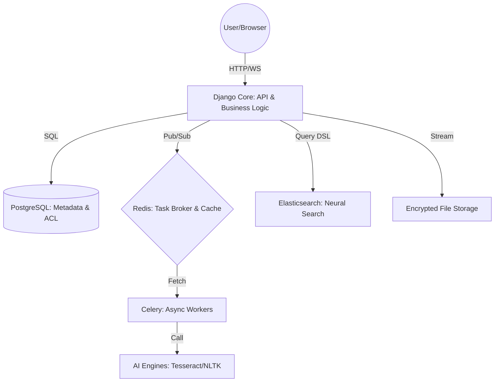

# Bab 1: Pondasi & Filosofi: Mengapa Harus Cloud Berdaulat?

## Cerita Di Balik Layar
Pada tahun 2021, dunia dikejutkan oleh kebocoran data dari beberapa penyedia layanan cloud raksasa. Jutaan foto pribadi, dokumen bisnis, dan identitas bocor ke forum peretas. Bagi sebagian orang, itu adalah bencana. Bagi seorang *Engineer*, itu adalah panggilan untuk bangun. Kita sadar bahwa "Cloud" sebenarnya hanyalah "Komputer milik orang lain". 

SovereignDrive AI lahir dari satu filosofi sederhana: **Kedaulatan Data (Data Sovereignty)**. Jika data adalah minyak baru, maka Anda harus memiliki kilang dan brankasnya sendiri. Bab ini akan memandu Anda memahami arsitektur dasar untuk merebut kembali kendali atas data Anda dan menyiapkan laboratorium pengembangan dengan standar industri.

---

## 1.1. Krisis Privasi di Era Digital

### 1.1.1. Sisi Gelap Penyimpanan Cloud Publik
Layanan gratis selalu datang dengan harga tersembunyi: privasi Anda. Cloud publik menggunakan algoritma untuk memindai foto Anda demi melatih AI mereka, atau menyajikan iklan yang ditargetkan. Selain itu, enkripsi yang mereka gunakan seringkali memiliki "pintu belakang" (*backdoor*) atau kuncinya dipegang oleh mereka, bukan Anda.

**Krisis dalam Angka:**
- Lebih dari **80%** perusahaan global menyimpan data sensitif di cloud publik.
- **60%** dari kebocoran data disebabkan oleh salah konfigurasi pada infrastruktur cloud pihak ketiga.
- Biaya rata-rata kebocoran data mencapai **$4.45 juta** per insiden pada tahun 2023.

### 1.1.2. Konsep Self-Sovereignty (Kedaulatan Data)
SovereignDrive mengadopsi pendekatan *Zero-Trust*. Sistem dirancang dengan asumsi bahwa server bisa saja diretas, tetapi peretas tidak akan mendapatkan apa-apa selain data acak (*ciphertext*). 

**Tiga Pilar Kedaulatan:**
1.  **Ownership (Kepemilikan):** Data fisik berada di bawah kendali Anda (Server lokal atau VPS milik sendiri).
2.  **Encryption (Enkripsi):** Kunci utama tidak pernah meninggalkan perangkat Anda atau server rahasia Anda.
3.  **Auditability (Dapat Diaudit):** Setiap baris kode sistem transparan dan dapat Anda audit sendiri.

---

## 1.2. Arsitektur SovereignDrive AI

Untuk membangun benteng ini, kita tidak menggunakan satu bahasa pemrograman, melainkan sebuah simfoni teknologi yang saling berkomunikasi melalui protokol standar.



### 1.2.1. Komponen Utama & Interaksinya
1. **Django (Python)**: Bertindak sebagai *Orchestrator*. Ia mengelola sesi pengguna, validasi izin (ACL), dan menjadi jembatan antar layanan.
2. **PostgreSQL**: Database relasional yang menyimpan struktur folder rekursif. Mengapa bukan NoSQL? Karena integritas data dan relasi antar folder sangat krusial dalam sistem file.
3. **Redis**: Sistem saraf pusat. Selain sebagai cache, ia adalah *Message Broker* yang menyimpan antrean tugas berat agar Django tidak terbebani.
4. **Elasticsearch**: Mata elang. Digunakan karena kemampuannya melakukan *Full-Text Search* pada jutaan dokumen dalam hitungan milidetik, sesuatu yang tidak bisa dilakukan SQL secara efisien.

### 1.2.2. Mengapa Python 3.12?
Python dipilih bukan hanya karena Django, tetapi karena efisiensi memori dan dukungan *Typing* yang lebih baik di versi 3.12. Ekosistem AI seperti Tesseract dan NLTK memiliki *wrapper* Python yang paling matang, memungkinkan kita mengintegrasikan kecerdasan buatan ke dalam penyimpanan data dengan sangat mudah.

---

## 1.3. Persiapan Lab Pengembangan (Infrastruktur)

Kita akan membangun laboratorium yang *reproducible* (dapat direplikasi). Artinya, setup di laptop Anda harus identik dengan setup di server produksi.

### 1.3.1. Modern Tooling: Migrasi ke `uv`
Meskipun `pip` adalah standar, di buku ini kita akan mengenal **`uv`**. Ini adalah paket manajer Python yang ditulis dalam Rust, yang **10x lebih cepat** daripada pip dan pip-tools. 

**Instalasi `uv`:**
- **Linux/macOS:** `curl -LsSf https://astral.sh/uv/install.sh | sh`
- **Windows:** `powershell -c "irm https://astral.sh/uv/install.ps1 | iex"`

### 1.3.2. Docker: Kontainerisasi Layanan Pendukung
Kita tidak akan menginstal PostgreSQL atau Elasticsearch langsung di OS. Kita akan menggunakan Docker untuk membungkusnya.

**File `docker-compose.yml` Dasar:**
```yaml
services:
  db:
    image: postgres:16
    environment:
      POSTGRES_DB: awan_db
      POSTGRES_PASSWORD: secretpassword
  redis:
    image: redis:7-alpine
  elasticsearch:
    image: elasticsearch:8.11.1
    environment:
      - discovery.type=single-node
      - xpack.security.enabled=false
```

---

## 1.4. The Sovereign Manifesto (10 Prinsip Utama)

Sebelum menulis baris kode pertama, kita harus menyepakati prinsip-prinsip ini agar sistem tetap aman:
1. **Zero Access by Default**: Tidak ada data yang bisa diakses tanpa token yang sah.
2. **Never Trust the Client**: Validasi semua input, termasuk ukuran dan tipe file.
3. **Stream Everything**: Jangan pernah memuat file besar ke RAM.
4. **Encrypt at Rest**: File di disk harus selalu dalam keadaan terenkripsi.
5. **Decouple Secrets**: Jangan simpan kunci enkripsi di database yang sama.
6. **Async by Nature**: Proses berat (OCR/Enkripsi) harus berjalan di background.
7. **Audit Every Move**: Catat setiap aksi krusial (hapus/unduh).
8. **Fail Securely**: Jika sistem error, ia harus menutup akses, bukan membukanya.
9. **No Hardcoding**: Semua konfigurasi sensitif ada di `.env`.
10. **Test the Fortress**: Sistem tanpa automated test adalah sistem yang rapuh.

---

## 1.5. Langkah Menjalankan Proyek (Standard Operating Procedure)

1.  **Clone & Setup**: 
    ```bash
    uv venv
    source .venv/bin/activate
    uv pip install -r requirements.txt
    ```
2.  **Environment Configuration**: Salin `.env.example` menjadi `.env` dan sesuaikan kunci rahasia Anda.
3.  **Boot Infrastructure**: `docker-compose up -d`.
4.  **Database Health Check**: Pastikan migrasi berjalan lancar dengan `python manage.py migrate`.
5.  **Verify Services**: Jalankan skrip `check_infra.sh` (tersedia di root proyek) untuk memastikan Redis dan ES merespons.

---

## 1.6. Common Pitfalls & Troubleshooting
- **Conflict Virtualenv**: Jika menggunakan `uv`, pastikan Anda tidak mencampuradukkannya dengan `pip` global untuk menghindari kebingungan *interpreter*.
- **Docker Port Conflict**: Jika port 5432 atau 6379 sudah terpakai oleh aplikasi lain di laptop Anda, ubah pemetaan port di `docker-compose.yml`.
- **ES Heap Size**: Elasticsearch bisa sangat rakus RAM. Jika ia gagal berjalan di laptop dengan RAM 8GB, tambahkan batasan memori di docker-compose: `ES_JAVA_OPTS=-Xms512m -Xmx512m`.

---

## ✅ Engineering Checkpoint: Pondasi & Infrastruktur
Sebelum melangkah ke arsitektur data yang lebih kompleks, pastikan laboratorium pengembangan Anda telah memenuhi standar berikut:
- [ ] **Arsitektur Client-Server:** Sudahkah Anda memahami bagaimana Django berinteraksi dengan database dan cache eksternal?
- [ ] **Environment Isolation:** Apakah Anda sudah menggunakan `uv` atau `venv` dan tidak menginstal library secara global?
- [ ] **Infrastructure-as-Code (Docker):** Apakah seluruh layanan pendukung (Postgre, Redis, ES) sudah berjalan secara stabil via Docker Compose?
- [ ] **Service Verification:** Apakah skrip pengecekan infra (`check_infra.sh`) mengembalikan status hijau untuk semua layanan?
- [ ] **Django MVT Mastery:** Apakah Anda sudah familiar dengan alur data dari Model ke View hingga dirender ke Template?
