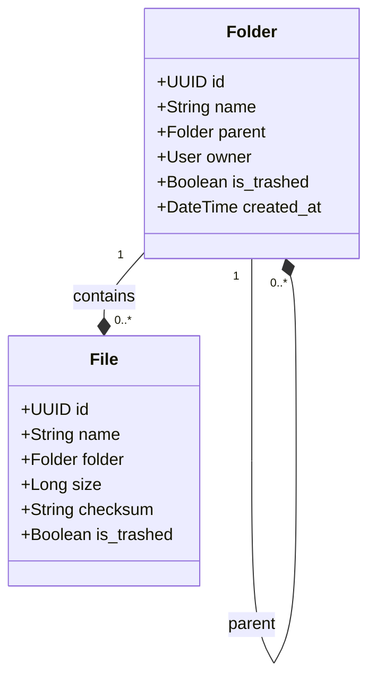

# Bab 2: Arsitektur Database & Hirarki Folder

## Cerita Di Balik Layar
Pernahkah Anda mencoba memindahkan folder yang berisi 10.000 file ke dalam folder lain? Pada sistem operasi yang buruk, proses ini bisa memakan waktu bermenit-menit. Namun, pada sistem yang efisien, proses ini terjadi dalam kedipan mata. Rahasianya ada pada bagaimana data tersebut dimodelkan di dalam database. 

Dalam bab ini, kita akan membongkar desain *schema* database SovereignDrive AI. Kita akan belajar bagaimana menyimpan miliaran file dan folder tanpa membuat database PostgreSQL kita "tersedak", serta bagaimana membangun sistem izin akses yang kompleks namun tetap cepat.

---

## 2.1. Pemodelan Hirarki: Adjacency List vs Path Enumeration

Sistem file di komputer Anda berbentuk pohon (Tree). Dalam dunia database, ada beberapa cara untuk menyimpan struktur pohon.

### 2.1.1. Adjacency List (Relasi Rekursif)
SovereignDrive menggunakan metode **Adjacency List**. Setiap folder menyimpan referensi ke "orang tua"-nya (`parent_id`). 



**Kelebihan:**
- **Instan Move:** Memindahkan folder (beserta seluruh isinya) hanya membutuhkan satu operasi SQL `UPDATE parent_id`. Ini sangat efisien.
- **Integritas:** Mudah untuk menjaga konsistensi data menggunakan *Foreign Key* bawaan database.

### 2.1.2. Tantangan: Mendapatkan "Full Path"
Kelemahan Adjacency List adalah saat kita ingin menampilkan *Breadcrumbs* (jalur lengkap folder, misal: `Home > Dokumen > Rahasia > Proyek A`). SQL harus melakukan query berulang kali (rekursif) ke atas untuk menemukan kakek, buyut, hingga akar folder. 

**Solusi SovereignDrive:** Kita menyimpan metadata tambahan atau menggunakan fitur **Recursive Common Table Expressions (CTE)** di PostgreSQL untuk menarik seluruh jalur dalam satu query tunggal yang sangat cepat.

---

## 2.2. Keamanan di Level Skema

### 2.2.1. UUIDv4 sebagai Primary Key
Jangan pernah menggunakan ID integer (1, 2, 3...) untuk entitas yang bisa diakses publik.
**Alasan Engineering:**
1.  **Anti-Enumeration:** Peretas tidak bisa menebak ID file lain.
2.  **Distributed Systems:** Jika Anda memiliki banyak server database (Sharding), UUID menjamin tidak akan ada konflik ID antar server.

### 2.2.2. Checksum (Digital Fingerprint)
Model `File` kita memiliki field `checksum` (SHA-256). 
- **Fungsi:** Memastikan integritas data. Jika data di disk berubah karena kerusakan hardware, checksum database tidak akan cocok.
- **De-duplication:** Jika dua user mengunggah file yang sama persis, kita bisa mendeteksinya via checksum dan menghemat penyimpanan (opsional).

---

## 2.3. Logika Navigasi & Optimasi Query

### 2.3.1. Masalah N+1 Query
Bayangkan Anda memiliki 100 file dalam satu folder. Jika Anda memanggil `file.owner.username` di dalam loop tanpa optimasi, Django akan melakukan 100 query tambahan ke tabel User. 

### 2.3.2. Senjata Rahasia: select_related & prefetch_related
- **`select_related('owner', 'folder')`**: Melakukan *SQL JOIN*. Gunakan ini untuk hubungan 1-ke-1 atau Banyak-ke-1.
- **`prefetch_related('accesses')`**: Melakukan query terpisah lalu menggabungkannya di Python. Gunakan ini untuk hubungan Banyak-ke-Banyak (seperti daftar user yang punya akses ke file tersebut).

---

## 2.4. Manajemen Quota & User Profile

SovereignDrive harus membatasi berapa banyak data yang bisa disimpan pengguna. Kita tidak menghitung total ukuran file setiap kali user mengunggah sesuatu (itu terlalu lambat).

### 2.4.1. Denormalisasi Kuota
Kita menyimpan `storage_used` di dalam model `UserProfile`. 
```python
class UserProfile(models.Model):
    user = models.OneToOneField(User, on_delete=models.CASCADE)
    storage_limit = models.BigIntegerField(default=15*1024*1024*1024) # 15GB
    storage_used = models.BigIntegerField(default=0)
```

### 2.4.2. Race Condition pada Kuota
Jika pengguna mengunggah dua file secara bersamaan dalam milidetik yang sama, kedua proses mungkin membaca nilai `storage_used` yang sama sebelum salah satunya mengupdate. Ini disebut **Race Condition**.
**Solusinya:** Gunakan `F()` expressions di Django:
`profile.storage_used = F('storage_used') + new_file_size`
Ini memaksa database melakukan penjumlahan di level SQL, menjamin akurasi meskipun ada ribuan upload bersamaan.

---

## 2.5. Soft Delete (Trash Bin) Architecture

Kita tidak pernah benar-benar menghapus data saat user menekan tombol "Hapus". Kita hanya memindahkannya ke Keranjang Sampah.
- **Field `is_trashed`**: Boolean filter yang ada di hampir setiap model.
- **Manager Kustom**: Kita membuat Django Manager kustom agar query `File.objects.all()` secara otomatis hanya mengembalikan file yang TIDAK ada di sampah, kecuali jika diminta secara eksplisit.

---

## 2.6. Arsitektur Unggahan Skala Besar (Chunked Upload)

Bagaimana jika pengguna ingin mengunggah file video berukuran 10GB dengan koneksi internet yang tidak stabil? Mengunggah dalam satu permintaan HTTP tunggal adalah resep bencana. Jika koneksi terputus di 99%, pengguna harus mengulang dari nol.

SovereignDrive memecahkannya dengan model **`FileChunk`**.

### 2.6.1. Mekanisme Pemecahan File
File besar dipecah menjadi potongan kecil (misal: per 2MB) di sisi klien. Setiap potongan dikirim secara terpisah ke server.
- **`upload_id`**: Token UUID unik yang mengikat seluruh potongan file yang sama.
- **`total_chunks` vs `received_chunks`**: Server melacak progres unduhan. Hanya jika semua potongan sudah diterima, proses penggabungan (Assembly) dimulai.

### 2.6.2. Penyimpanan Sementara Potongan
Server menyimpan potongan file di direktori khusus (`/media/chunks/<upload_id>/`) sebelum digabungkan. Hal ini mencegah penggunaan memori RAM yang berlebihan karena potongan file langsung ditulis ke disk.

```python
class FileChunk(models.Model):
    upload_id = models.UUIDField(default=uuid.uuid4, unique=True, db_index=True)
    total_chunks = models.IntegerField()
    received_chunks = models.IntegerField(default=0)
    
    def get_chunk_path(self, chunk_index):
        directory = os.path.join(settings.MEDIA_ROOT, 'chunks', str(self.upload_id))
        os.makedirs(directory, exist_ok=True)
        return os.path.join(directory, f'part_{chunk_index}')
```

---

## 2.7. Common Pitfalls (Lubang Jebakan)

1.  **Circular References:** Apa yang terjadi jika Folder A adalah orang tua Folder B, dan Anda mencoba menjadikan Folder B sebagai orang tua Folder A? Anda menciptakan *Infinite Loop*. 
    *   **Solusi:** Selalu validasi hirarki di level Model `clean()` atau gunakan database trigger.
2.  **Missing DB Indexes:** Tanpa indeks pada field `parent` dan `owner`, mencari file di dalam folder yang berisi jutaan data akan memakan waktu berdetik-detik. Pastikan `db_index=True` terpasang.

---

## ✅ Engineering Checkpoint: Arsitektur Data & Optimasi
Pastikan desain database Anda siap menangani jutaan baris data dengan memverifikasi poin-poin berikut:
- [ ] **Recursive Integrity:** Apakah model `Folder` Anda sudah menangani relasi *self-referential* dengan benar?
- [ ] **ID Security:** Apakah seluruh model utama sudah menggunakan UUIDv4 untuk mencegah serangan IDOR?
- [ ] **Query Efficiency:** Sudahkah Anda menggunakan `select_related` untuk mematikan N+1 Query Problem pada metadata file?
- [ ] **Quota Reliability:** Apakah pembaruan kuota sudah menggunakan `F()` expressions atau `select_for_update` untuk mencegah *race condition*?
- [ ] **Trash Logic:** Apakah sistem *Soft Delete* (`is_trashed`) sudah terimplementasi secara konsisten di seluruh model?
- [ ] **Database Indexing:** Apakah indeks sudah terpasang pada field yang menjadi kunci pencarian dan filter?
