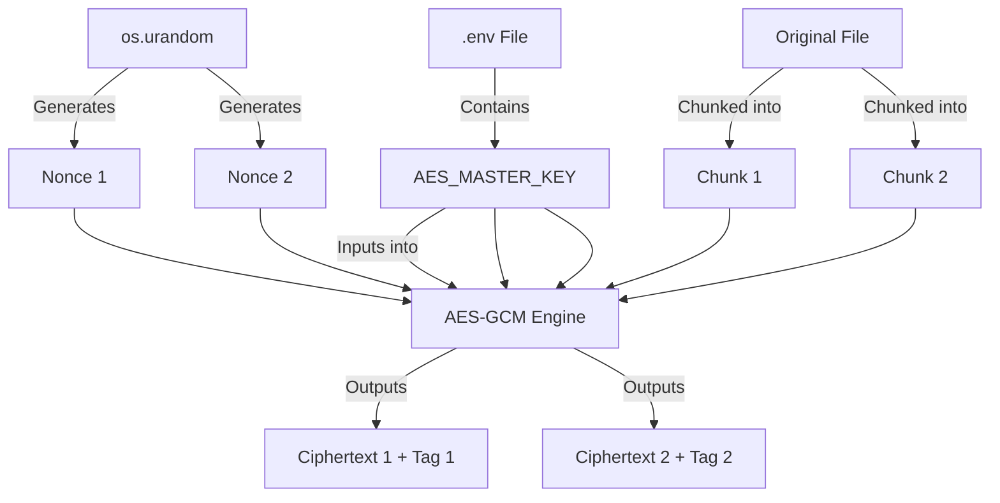

# Bab 3: Kriptografi: Mengunci Gerbang Data

## Cerita Di Balik Layar
Bayangkan Anda memiliki brankas paling kuat di dunia, tetapi kuncinya Anda selipkan di bawah keset depan pintu. Itulah yang terjadi jika Anda membangun Cloud tanpa strategi enkripsi yang matang. Dalam bab ini, kita akan mempelajari bagaimana SovereignDrive AI memastikan bahwa bahkan administrator sistem atau peretas yang berhasil menembus server tidak akan bisa membaca satu bit pun data Anda tanpa kunci utama.

Kriptografi di SovereignDrive bukan sekadar "pemanis" fitur; ia adalah pondasi di mana seluruh sistem berdiri. Kita akan membedah dari teori matematika dasar AES-GCM hingga implementasi *Custom Storage Backend* di Django yang menangani enkripsi secara transparan.

---

## 3.1. Anatomi Keamanan: Mengapa AES-256 GCM?

Dalam dunia kriptografi simetris, terdapat berbagai "mode" operasi. Dua yang paling populer adalah CBC (Cipher Block Chaining) dan GCM (Galois/Counter Mode). 

### 3.1.1. Masalah pada AES-CBC
Banyak tutorial Django lama menyarankan penggunaan AES-CBC. Namun, CBC memiliki kelemahan fatal: ia tidak menjamin **Integritas**. Seorang peretas dapat memanipulasi bit tertentu dalam file terenkripsi (serangan *Bit Flipping*), dan sistem Anda akan mendekripsinya menjadi data yang salah tanpa menyadari bahwa file tersebut telah dimodifikasi.

### 3.1.2. Keunggulan AES-GCM (Authenticated Encryption)
SovereignDrive menggunakan **AES-256 GCM**. Ini adalah standar emas saat ini karena merupakan *Authenticated Encryption with Associated Data* (AEAD). 
1.  **Kerahasiaan (Confidentiality)**: Data Anda diubah menjadi ciphertext yang mustahil dibaca tanpa kunci.
2.  **Integritas & Autentikasi**: GCM menghasilkan sebuah "Authentication Tag" (16 byte). Jika peretas mengubah satu bit saja dalam file di disk, proses dekripsi akan gagal dengan error `InvalidTag`.
3.  **Performa Tinggi**: GCM dapat diparalelkan di level instruksi CPU (menggunakan instruksi `AES-NI`), sehingga proses enkripsi file 1GB hampir tidak terasa bebannya pada CPU modern.

---

## 3.2. Arsitektur Manajemen Kunci (Key Management)

Kesalahan pemula adalah menggunakan `SECRET_KEY` Django sebagai kunci enkripsi. Jika server Anda diretas dan Anda harus mengganti `SECRET_KEY`, tiba-tiba Anda kehilangan akses ke semua file Anda selamanya karena data tidak lagi bisa didekripsi dengan kunci baru.

### 3.2.1. Key Decoupling Strategy
Kita memisahkan tanggung jawab kunci menjadi tiga lapis:
1.  **Django SECRET_KEY**: Hanya untuk session, cookies, dan signing internal Django.
2.  **AES_MASTER_KEY**: Kunci 256-bit (32 karakter) yang disimpan di environment variable (`.env`) khusus untuk data.
3.  **Per-File Nonce**: Setiap potongan file (chunk) memiliki "Nonce" (Number Used Once) acak 12-byte. Ini memastikan bahwa meskipun Anda mengunggah 10 file yang isinya identik, hasil ciphertext di disk akan 100% berbeda.

### 3.2.2. Visualisasi Hirarki Kunci


---

## 3.3. Implementasi Streaming Encryption (The Deep Dive)

Memproses file besar (misal: video 4K berukuran 5GB) di server dengan RAM terbatas (misal: VPS 1GB) adalah tantangan engineering. Kita tidak bisa membaca seluruh file ke memori.

### 3.3.1. Teknik Chunking & Generators
Kita menggunakan fitur **Generator** di Python (`yield`) untuk membuat "pipa" data. Data mengalir dari input, dienkripsi 64KB demi 64KB, dan langsung dikirim ke penyimpanan.

### 3.3.2. Bedah Struktur Byte di Disk (.enc)
Format file SovereignDrive di penyimpanan tidak sembarangan. Ia memiliki struktur header khusus:

| Offset | Ukuran | Nama | Deskripsi |
| :--- | :--- | :--- | :--- |
| 0 | 12 Byte | **Magic Header** | String `AWAN_AESGCM\x00` untuk identitas file. |
| 12 | 4 Byte | **Chunk Length** | Panjang data terenkripsi (Little-Endian). |
| 16 | 12 Byte | **Nonce** | Angka acak unik untuk chunk ini. |
| 28 | Variabel | **Ciphertext** | Data asli yang sudah terenkripsi + 16 byte Auth Tag. |
| ... | ... | ... | (Berulang untuk setiap chunk selanjutnya) |

---

## 3.4. Proses Dekripsi: Membongkar Paket Biner

Jika enkripsi adalah proses "membungkus", maka dekripsi adalah seni "membongkar" tanpa merusak isinya. Perhatikan bagaimana fungsi `decrypt_stream` bekerja di balik layar:

```python
def decrypt_stream(input_stream):
    # [1] Validasi Magic Header
    header = input_stream.read(12)
    if header != STREAM_MAGIC_HEADER:
        raise ValueError("File korup atau bukan format SovereignDrive!")

    key = get_aesgcm_key()
    aesgcm = AESGCM(key)

    while True:
        # [2] Membaca Panjang Chunk (4 byte)
        len_bytes = input_stream.read(4)
        if not len_bytes: break
        chunk_len = struct.unpack('<I', len_bytes)[0]
        
        # [3] Membaca Nonce (12 byte)
        nonce = input_stream.read(12)
        
        # [4] Membaca Ciphertext sesuai panjang yang disimpan
        encrypted_chunk = input_stream.read(chunk_len)
        
        # [5] Dekripsi & Validasi Tag Autentikasi
        try:
            yield aesgcm.decrypt(nonce, encrypted_chunk, None)
        except Exception:
            raise ValueError("Integritas data gagal: File telah dimodifikasi!")
```

**Analisis Teknikal:**
- **`struct.unpack('<I', len_bytes)`**: Kita menggunakan Little-Endian (`<`) untuk memastikan file bisa dibaca di berbagai arsitektur CPU (Intel, ARM, dll) dengan konsisten.
- **`try...except`**: Inilah letak kekuatan AES-GCM. Jika satu bit saja dalam `encrypted_chunk` berubah, fungsi `decrypt` akan melempar *exception*. Kita tidak hanya mendekripsi, tapi juga melakukan audit keamanan secara *real-time*.

---

## 3.5. Advanced Engineering: Custom Django Storage Backend

Agar pengembang aplikasi tidak perlu memikirkan enkripsi setiap kali memanggil `file.save()`, kita akan mengintegrasikan logika ini ke dalam sistem internal Django.

### 3.5.1. EncryptedStreamWrapper: Sang Jembatan
Django mengharapkan objek file yang memiliki metode `.read()`. Namun, generator kita (`encrypt_stream`) hanya memiliki metode `next()`. Kita butuh *wrapper* untuk mengubah generator menjadi file virtual.

```python
class EncryptedStreamWrapper:
    def __init__(self, generator):
        self.gen = generator
        self.buffer = b''

    def read(self, size=-1):
        while size == -1 or len(self.buffer) < size:
            try:
                self.buffer += next(self.gen)
            except StopIteration:
                break
        
        # Kirim data sesuai ukuran yang diminta Django
        chunk, self.buffer = self.buffer[:size], self.buffer[size:]
        return chunk
```

### 3.5.2. Implementasi Custom Storage
Dengan mewarisi `FileSystemStorage`, kita bisa melakukan *intercept* pada proses tulis dan baca.

```python
class EncryptedFileSystemStorage(FileSystemStorage):
    def _save(self, name, content):
        # Enkripsi otomatis saat user mengunggah file
        wrapped_content = EncryptedStreamWrapper(encrypt_stream(content))
        return super()._save(name, wrapped_content)

    def open(self, name, mode='rb'):
        # Dekripsi otomatis saat file dibuka oleh aplikasi
        raw_file = super().open(name, mode)
        if 'b' in mode:
            return DecryptedStreamWrapper(decrypt_stream(raw_file))
        return raw_file
```

---

## 3.6. Keamanan Kunci di Produksi: HashiCorp Vault & KMS

Untuk aplikasi level korporat, menyimpan `AES_MASTER_KEY` di file `.env` masih dianggap berisiko tinggi (karena file `.env` sering tidak sengaja terbawa ke backup atau log server).

### 3.6.1. Penggunaan External KMS
SovereignDrive dirancang agar bisa menggunakan **Key Management Service (KMS)** eksternal seperti **HashiCorp Vault** atau **AWS KMS**.
- Alur: Django meminta "Kunci Data" ke Vault saat startup.
- Keuntungan: Kunci utama tidak pernah ada di disk server aplikasi. Jika server diretas, peretas tidak akan menemukan kunci enkripsi di sana.

### 3.6.2. Strategi Rotasi Kunci (Versioning)
Kita menggunakan **Magic Header Versioning**. 
- Header `AWAN_V1`: Menggunakan kunci lama.
- Header `AWAN_V2`: Menggunakan kunci baru.
Sistem dapat mengenali versi header dan memilih kunci yang tepat dari *Key History* secara otomatis.

---

## 3.7. Common Pitfalls (Lubang Jebakan)

1.  **Nonce Collision**: Menggunakan Nonce yang sama untuk dua data berbeda. Ini adalah "dosa besar" dalam AES-GCM yang bisa membocorkan kunci. Selalu gunakan `os.urandom(12)`.
2.  **Lack of Authentication Tag Verification**: Mengabaikan error saat dekripsi. Jika dekripsi gagal, **jangan pernah** menampilkan data yang terpotong ke user; itu bisa menjadi celah keamanan.
3.  **Storing IV in Database**: Beberapa orang menyimpan IV/Nonce di database SQL. Ini tidak perlu jika Anda menggunakan struktur biner SovereignDrive yang menyisipkan Nonce di dalam file itu sendiri.

---

## ✅ Engineering Checkpoint: Keamanan & Kriptografi
Keamanan data adalah harga mati. Pastikan benteng kriptografi Anda telah memenuhi standar industri:
- [ ] **Authenticated Encryption:** Apakah Anda sudah menggunakan AES-256 GCM untuk menjamin kerahasiaan sekaligus integritas data?
- [ ] **Cryptographic Nonce:** Apakah setiap chunk file sudah menggunakan Nonce unik hasil dari `os.urandom(12)`?
- [ ] **Binary Unpacking Integrity:** Apakah fungsi dekripsi sudah memvalidasi *Magic Header* dan *Authentication Tag* secara ketat?
- [ ] **Transparent Automation:** Apakah enkripsi sudah diintegrasikan ke dalam *Custom Storage Backend* menggunakan `StreamWrapper`?
- [ ] **Memory Safety:** Apakah seluruh proses dilakukan secara streaming (64KB chunks) untuk mencegah lonjakan RAM (OOM)?
- [ ] **Secret Isolation:** Apakah kunci utama sudah dipisahkan dari `SECRET_KEY` Django dan dipersiapkan untuk integrasi KMS eksternal?
