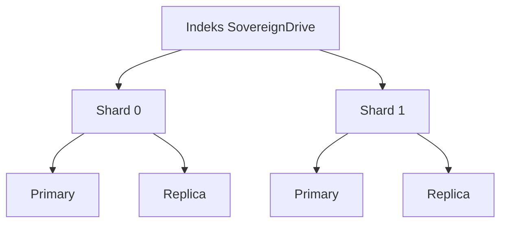

# Bab 5: Elasticsearch: Pencarian Secepat Kilat

## Cerita Di Balik Layar
Menggunakan perintah `LIKE '%kata%'` di SQL untuk mencari teks di dalam jutaan dokumen sama seperti mencari satu kutipan spesifik di perpustakaan nasional dengan membaca buku satu per satu. Sangat lambat dan memakan resource tinggi karena database harus memindai setiap baris secara linear.

Di sinilah **Elasticsearch (ES)** masuk. Ia bukan database biasa; ia adalah mesin telusur terdistribusi yang dibangun di atas Apache Lucene. Ia menggunakan struktur **Inverted Index**, mirip dengan daftar indeks di halaman belakang sebuah buku ensiklopedia. Dalam bab ini, kita akan membangun "saraf pengingat" SovereignDrive yang mampu menemukan satu kata di antara jutaan halaman dokumen dalam hitungan milidetik.

---

## 5.1. Arsitektur Search Engine Terdistribusi

Elasticsearch dirancang untuk skala besar. Sebelum menulis kode, kita harus memahami bagaimana ia menyimpan data di balik layar.

### 5.1.1. Inverted Index: Rahasia Kecepatan
Dalam database relasional, data disimpan per baris (Row-based). Elasticsearch membaliknya. 

**Contoh Sederhana:**
- Dokumen 1: "Kopi pahit"
- Dokumen 2: "Kopi susu"

**Inverted Index:**
- "Kopi" -> [1, 2]
- "Pahit" -> [1]
- "Susu" -> [2]

Saat Anda mencari "Kopi", ES tidak memindai isi dokumen. Ia langsung melihat ke entri "Kopi" dan mendapatkan daftar ID dokumen [1, 2] seketika.

### 5.1.2. Shards dan Replicas
Untuk ketahanan data, ES membagi indeks menjadi beberapa **Shards** (potongan data).
- **Primary Shard**: Tempat data asli disimpan dan diproses.
- **Replica Shard**: Salinan data untuk berjaga-jaga jika server mati, sekaligus membantu mempercepat proses pencarian (Read Scalability).



---

## 5.2. Membangun Skema (Mapping) Cerdas

Di Elasticsearch, desain skema disebut **Mapping**. Kita harus menentukan tipe data yang tepat agar pencarian menjadi cerdas.

### 5.2.1. Text vs Keyword
- **`text`**: Digunakan untuk konten panjang (isi dokumen). Teks ini akan diurai (*analyzed*) menjadi kata-kata dasar.
- **`keyword`**: Digunakan untuk data yang harus sama persis (ID, Tag, Owner). Data ini tidak akan diurai.

### 5.2.2. Indonesian Analysis Pipeline
Salah satu fitur terkuat SovereignDrive adalah kemampuannya memahami Bahasa Indonesia. Kita menggunakan analyzer `indonesian` yang melakukan tiga tahap:
1.  **Character Filter**: Membersihkan karakter sampah (HTML, simbol).
2.  **Tokenizer**: Memecah kalimat menjadi kata (token).
3.  **Token Filter**: Membuang *stopwords* (di, ke, yang) dan melakukan *stemming* (mengubah "berlari" menjadi "lari").

---

## 5.3. Bedah Kode: Integrasi Django DSL

Kita menggunakan `django_elasticsearch_dsl` untuk mensinkronkan model `File` kita ke indeks Elasticsearch secara otomatis.

```python
# storage/documents.py
@registry.register_document
class FileDocument(Document):
    # [1] Multi-field: Mencari teks sekaligus filtering keyword
    name = fields.TextField(
        fields={'raw': fields.KeywordField()}
    )
    
    # [2] Analyzer Indonesia untuk hasil OCR
    extracted_text = fields.TextField(
        analyzer='indonesian',
        fields={'suggest': fields.CompletionField()} # Untuk Auto-complete
    )

    owner_id = fields.IntegerField()
    is_trashed = fields.BooleanField()

    class Index:
        name = 'sovereigndrive_files'
        settings = {'number_of_shards': 1, 'number_of_replicas': 0}
```

### 5.3.1. Query DSL: Search Relevance Engineering
Pencarian yang baik bukan hanya soal menemukan data, tapi menampilkan yang paling relevan di urutan teratas.

```python
search = FileDocument.search().query(
    "bool",
    should=[
        # Nama file 3x lebih penting daripada isi teks (Boosting)
        ES_Q("multi_match", query=q, fields=['name^3'], fuzziness="AUTO"),
        ES_Q("multi_match", query=q, fields=['extracted_text'], fuzziness="AUTO"),
    ],
    minimum_should_match=1
).filter(
    "term", owner_id=user.id # Security: Jangan tampilkan file orang lain
).filter(
    "term", is_trashed=False # Jangan tampilkan file di tempat sampah
)
```

**Analisis Teknikal:**
- **`bool` query**: Menggabungkan beberapa kriteria (Should = Opsional tapi menambah skor, Filter = Wajib dan tidak menambah skor).
- **`fuzziness="AUTO"`**: Menggunakan algoritma *Levenshtein Distance*. Jika user mengetik "Lapotp", sistem tetap menemukan "Laptop".
- **Boosting (`^3`)**: Teknik psikologis agar user merasa sistem "pintar" karena hasil yang nama filenya mirip muncul paling atas.

---

## 5.4. Sinkronisasi Data & Performance Hardening

### 5.4.1. Asynchronous Indexing (Celery)
Jangan pernah melakukan sinkronisasi ke Elasticsearch di dalam siklus permintaan web (Request-Response). Jika server ES sedang sibuk atau lambat, user akan menunggu lama. 
**Solusi:** Gunakan Celery untuk mengirim data ke ES di latar belakang.

### 5.4.2. Linux System Tuning
Elasticsearch membutuhkan resource yang stabil. Di server produksi, Anda wajib melakukan konfigurasi berikut:
1.  **Virtual Memory**: `sysctl -w vm.max_map_count=262144`. Tanpa ini, ES akan crash saat mencoba melakukan indexing berat.
2.  **Heap Size**: Jangan biarkan ES menggunakan seluruh RAM. Atur `ES_JAVA_OPTS` agar menggunakan maksimal 50% dari total RAM server (misal: `-Xmx1g -Xms1g` untuk RAM 2GB).

---

## 5.5. Common Pitfalls (Lubang Jebakan)

1.  **Mapping Explosion**: Membuat terlalu banyak field dinamis di Elasticsearch. Ini bisa menghabiskan memori server. Selalu definisikan mapping secara eksplisit.
2.  **Split Brain**: Kondisi di mana cluster ES terbagi dua dan kehilangan konsistensi data. Hindari ini dengan mengonfigurasi `discovery.seed_hosts` dengan benar di Docker.
3.  **Near Real-Time (NRT)**: Elasticsearch tidak langsung menyimpan data ke disk (ada jeda *refresh* sekitar 1 detik). Jangan gunakan ES untuk data yang membutuhkan konsistensi instan (seperti saldo bank).

---

## ✅ Engineering Checkpoint: Search Engine Engineering
Pastikan fitur pencarian Anda memberikan hasil yang relevan dan cepat kepada pengguna:
- [ ] **Distributed Logic:** Apakah Anda sudah menentukan jumlah *Shards* dan *Replicas* sesuai kapasitas server?
- [ ] **Mapping Precision:** Sudahkah Anda memisahkan field `text` (untuk pencarian) dan `keyword` (untuk filtering)?
- [ ] **Linguistic Analysis:** Apakah *Indonesian Analyzer* sudah aktif untuk menangani morfologi bahasa Nusantara?
- [ ] **Relevance Boosting:** Apakah query pencarian sudah memberikan bobot lebih pada nama file dibanding isi dokumen?
- [ ] **Security Filtering:** Apakah setiap query pencarian sudah dipaksa melakukan filter berdasarkan `owner_id` untuk mencegah kebocoran data?
- [ ] **OS Level Tuning:** Apakah parameter `vm.max_map_count` sudah dikonfigurasi pada sistem operasi host?
- [ ] **Async Sync:** Apakah sinkronisasi data dilakukan via Celery untuk menjaga responsivitas UI?
