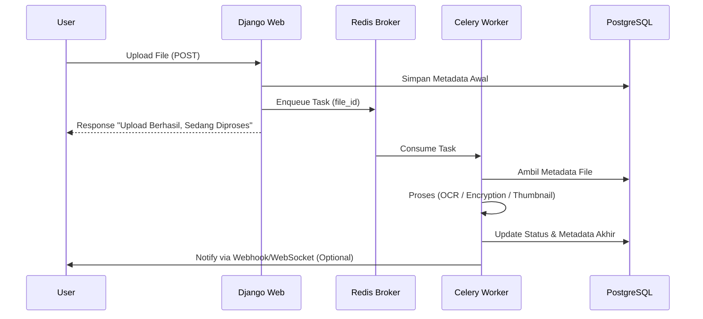

# Bab 6: Celery: Pekerja di Balik Layar

## Cerita Di Balik Layar
Bayangkan sebuah restoran mewah. Pelayan (Django Web Server) menerima pesanan steak yang rumit dari pelanggan (User). Jika pelayan itu sendiri yang memasak steak tersebut, ia akan diam di dapur selama 30 menit, dan pelanggan lain tidak akan terlayani. Pengguna akan melihat layar "hang" atau *timeout*.

Cara yang benar? Pelayan mencatat pesanan, menyerahkannya ke Dapur (Message Broker), lalu kembali melayani pelanggan lain. Para Koki (**Celery Workers**) di dapur akan memasak pesanan tersebut secara paralel. Di SovereignDrive AI, tugas berat seperti enkripsi video, OCR dokumen ribuan halaman, dan watermarking PDF dilakukan oleh para "Koki" digital ini.

---

## 6.1. Anatomi Sistem Terdistribusi Celery

Celery bukan sekadar library, ia adalah sistem pemrosesan tugas terdistribusi. Untuk menjalankannya, kita butuh tiga komponen utama yang bekerja dalam harmoni.

### 6.1.1. Broker vs Backend: Perbedaan yang Krusial
1.  **Message Broker (Redis/RabbitMQ)**: Ini adalah "Papan Antrean". Tempat Django menaruh pesan tugas. Broker bertanggung jawab untuk memastikan pesan sampai ke worker, namun ia tidak menyimpan hasil kerja.
2.  **Result Backend (Redis/Database)**: Ini adalah "Loker Hasil". Tempat worker menaruh status tugas (Success/Fail) dan data hasil (misal: ID file thumbnail). Tanpa backend, Django tidak akan pernah tahu apakah tugas di latar belakang sudah selesai atau belum.

### 6.1.2. Alur Kerja Asinkron (Sequence)


---

## 6.2. Engineering Best Practices: Resiliensi & Skalabilitas

Membangun sistem asinkron yang tangguh membutuhkan lebih dari sekadar fungsi `@shared_task`. Anda harus memikirkan kegagalan.

### 6.2.1. Idempotensi: Aturan Emas Worker
Sebuah tugas disebut **Idempotent** jika dijalankan satu kali atau sepuluh kali, hasilnya tetap sama dan tidak merusak data.
- **Masalah**: Jika worker mati di tengah jalan saat memotong kuota, dan Celery menjalankan ulang tugas tersebut, kuota user bisa terpotong dua kali.
- **Solusi**: Selalu cek status di database sebelum melakukan perubahan. *"Apakah file ini sudah di-watermark? Jika ya, jangan lakukan lagi."*

### 6.2.2. Retry Strategy dengan Exponential Backoff
Jangan menyerah saat tugas gagal (misal: API Tesseract sedang sibuk). Namun, jangan langsung mencoba lagi dalam milidetik yang sama.
```python
@shared_task(bind=True, max_retries=5)
def process_ai_task(self, file_id):
    try:
        # ... logika berat ...
    except TemporaryError as exc:
        # Mencoba lagi dengan jeda yang semakin lama (2s, 4s, 8s...)
        raise self.retry(exc=exc, countdown=2 ** self.request.retries)
```

---

## 6.3. Manajemen Resource: Menghadapi OOM & CPU Spikes

### 6.3.1. Membatasi Concurrency
Jika server Anda memiliki 4 Core CPU, jangan biarkan Celery menjalankan 100 worker sekaligus. Ini akan menyebabkan *CPU Thrashing*. Gunakan opsi `--concurrency=4` saat menjalankan worker untuk efisiensi maksimal.

### 6.3.2. Memerangi Kebocoran Memori (Memory Leaks)
Library Python seperti Pillow atau Tesseract kadang tidak melepaskan RAM dengan sempurna setelah selesai. 
**Solusi Engineer**: Gunakan flag `--max-tasks-per-child=10`. Ini akan memaksa proses worker untuk mati dan lahir baru setelah mengerjakan 10 tugas, membersihkan seluruh sisa RAM yang bocor secara otomatis.

---

## 6.4. Observability: Memantau "Dapur" dengan Flower

Bagaimana Anda tahu ada berapa banyak tugas yang sedang mengantre? Mana tugas yang paling sering gagal?
Kita menggunakan **Flower**, sebuah dashboard web untuk memantau Celery secara *real-time*.

**Fitur Utama Flower:**
- Melihat grafik kecepatan pemrosesan tugas.
- Membatalkan (*Revoke*) tugas yang memakan waktu terlalu lama.
- Melihat log error spesifik dari setiap worker yang tersebar di berbagai server.

---

## 6.5. Tugas Pemeliharaan Otomatis (Maintenance Tasks)

Sistem produksi memerlukan rutinitas pembersihan agar tidak "berlumut". Berikut adalah tugas-tugas yang dijalankan secara periodik via **Celery Beat**:

### 6.5.1. Audit Kuota: Mencegah Data Drift
Terkadang, karena server mati mendadak atau bug pada signal, nilai `storage_used` di database bisa berbeda dengan ukuran file asli. Kita menjalankan audit periodik untuk mencocokkan kembali data.

```python
@shared_task
def sync_all_users_quota_task():
    users = User.objects.all()
    for user in users:
        actual_usage = File.objects.filter(owner=user, is_trashed=False).aggregate(total=Sum('size'))['total'] or 0
        profile, _ = UserProfile.objects.get_or_create(user=user)
        if profile.storage_used != actual_usage:
            profile.storage_used = actual_usage
            profile.save()
```

### 6.5.2. Garbage Collection (Cleanup)
Membersihkan file ZIP sisa download atau potongan file (*chunks*) yang tidak selesai diunggah.

---

## 6.6. Common Pitfalls (Lubang Jebakan)

1.  **Passing Objects as Arguments**: Jangan pernah mengirim objek model Django lengkap ke dalam tugas Celery (misal: `my_task.delay(file_instance)`). Objek tersebut mungkin sudah berubah atau kedaluwarsa saat worker mengambilnya. **Selalu kirim Primary Key (ID)** dan biarkan worker mengambil data terbaru dari database.
2.  **Database Deadlocks**: Terlalu banyak worker yang mencoba mengupdate baris yang sama di database (misal: User Profile Quota) secara bersamaan. Gunakan `select_for_update()` untuk mengunci baris secara aman.
3.  **Ignoring Worker Logs**: Selalu arahkan log worker ke sistem monitoring (seperti ELK Stack atau Sentry). Tanpa log, menelusuri bug di sistem asinkron adalah mimpi buruk.

---

## ✅ Engineering Checkpoint: Asynchronous Architecture
Pastikan sistem antrean tugas Anda efisien dan tangguh terhadap kegagalan:
- [ ] **Broker & Backend Isolation:** Apakah Redis sudah terpisah peranannya sebagai broker dan result backend?
- [ ] **Task Idempotency:** Apakah setiap tugas aman untuk dijalankan ulang tanpa menyebabkan duplikasi data atau kesalahan logika?
- [ ] **Exponential Backoff:** Sudahkah Anda mengimplementasikan strategi retry yang cerdas untuk menangani kegagalan temporer?
- [ ] **Resource Limiting:** Apakah jumlah concurrency dan `--max-tasks-per-child` sudah disesuaikan dengan spesifikasi RAM/CPU server?
- [ ] **Primary Key Passing:** Apakah Anda hanya mengirimkan ID (bukan objek lengkap) ke dalam parameter `delay()`?
- [ ] **Monitoring Integration:** Apakah Flower atau Sentry sudah terpasang untuk memantau kesehatan worker di produksi?
- [ ] **Periodic Automation:** Apakah tugas pembersihan (cleanup) dan audit sudah dijadwalkan via Celery Beat?
