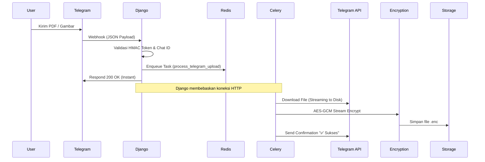

# Bab 7: Integrasi Bot Telegram & API: Jembatan Antar Platform

## Cerita Di Balik Layar
Mengapa membatasi penyimpanan cloud hanya melalui peramban web? Terkadang, ide brilian atau dokumen penting datang melalui pesan instan saat Anda sedang di perjalanan. SovereignDrive AI mendobrak batas antar-platform dengan memungkinkan pengguna meneruskan (*forward*) pesan dari Telegram, dan file tersebut akan langsung terenkripsi dan masuk ke dalam Cloud pribadi secara otomatis.

Namun, membuka "pintu" agar sistem luar seperti Telegram bisa masuk membawa risiko keamanan yang besar. Bab ini membahas cara membuat terowongan yang aman antar platform dan bagaimana mengelola hak akses yang kompleks secara efisien.

---

## 7.1. Membangun Webhook yang Aman & Resilien

Alih-alih SovereignDrive terus-menerus bertanya ke Telegram, "Apakah ada pesan baru?" (Polling), kita menggunakan **Webhook**. Telegram akan "mengetuk" pintu URL server kita setiap kali ada aktivitas.

### 7.1.1. Visualisasi Alur Data Telegram


### 7.1.2. Keamanan Webhook: Token Hashing
Pintu Webhook bersifat publik. Kita mengamankannya dengan **Token Hashing**. URL kita terlihat seperti: `https://api.awan.com/webhook/telegram/?token=8f3d...`.
Token ini dihasilkan dari `hashlib.sha256(settings.SECRET_KEY)`. Tanpa token yang cocok, Django akan menolak permintaan bahkan sebelum membaca isi pesan.

---

## 7.2. Otorisasi & ACL (Access Control List) Tingkat Lanjut

Membagikan file bukan sekadar memberikan URL. Kita butuh sistem izin yang cerdas.

### 7.2.1. Hirarki Izin (Permission Inheritance)
Dalam struktur folder rekursif, jika Anda memiliki akses ke "Folder A", Anda otomatis memiliki akses ke semua sub-folder di dalamnya.
**Masalah Engineering**: Bagaimana mengecek ini dengan cepat tanpa melakukan puluhan query database?
**Solusi**: Kita menggunakan **Recursive Permission Check** dengan limitasi kedalaman untuk mencegah *infinite loop*.

### 7.2.2. Shared Link dengan Proteksi Ganda
Saat user membuat tautan publik, SovereignDrive menerapkan protokol keamanan:
1.  **Unique Token**: Menggunakan UUIDv4 yang tidak terduga.
2.  **Bcrypt Password**: Jika tautan diproteksi sandi, kita menggunakan `bcrypt` untuk hashing.
3.  **Expiry Logic**: Sistem secara otomatis mengecek field `expires_at` pada setiap permintaan akses.

---

## 7.3. Bedah Kode: Streaming Download & Integration

Berikut adalah potongan logika krusial dalam `storage/tasks/__init__.py` yang menangani unduhan dari Telegram:

```python
@shared_task
def process_telegram_upload_task(chat_id, file_id, file_name):
    # [1] Dapatkan URL Download dari Telegram API
    bot_token = settings.TELEGRAM_BOT_TOKEN
    file_info = requests.get(f"https://api.telegram.org/bot{bot_token}/getFile?file_id={file_id}").json()
    file_path = file_info['result']['file_path']
    download_url = f"https://api.telegram.org/file/bot{bot_token}/{file_path}"

    # [2] Streaming Download ke Temporary File (Anti-OOM)
    with tempfile.NamedTemporaryFile(delete=False) as tmp:
        with requests.get(download_url, stream=True) as r:
            for chunk in r.iter_content(chunk_size=128*1024):
                tmp.write(chunk)
        tmp_path = tmp.name

    # [3] Gunakan Upload Service (Enkripsi Otomatis)
    with open(tmp_path, 'rb') as f:
        user = UserProfile.objects.get(telegram_chat_id=chat_id).user
        new_file = upload_file_service(user, f, name=file_name)
    
    os.remove(tmp_path)
```

**Analisis Teknikal:**
- **`requests.get(stream=True)`**: Kita tidak memuat seluruh file ke RAM. Data mengalir langsung dari server Telegram ke disk lokal kita.
- **`NamedTemporaryFile`**: Menjamin file dihapus atau terisolasi, mencegah kebocoran data antar proses.

---

## 7.4. Algoritma Cycle Detection pada Folder

Dalam sistem file berbasis database, ada risiko "Circular Reference" (misal: Folder A menjadi parent Folder B, dan Folder B menjadi parent Folder A). Ini bisa menyebabkan sistem izin kita terjebak selamanya.

**Implementasi Deteksi:**
```python
def has_cycle(folder, visited=None):
    if visited is None: visited = set()
    if folder.id in visited: return True
    visited.add(folder.id)
    if folder.parent:
        return has_cycle(folder.parent, visited)
    return False
```
Setiap kali user mencoba memindahkan folder, SovereignDrive menjalankan algoritma ini untuk memastikan integritas struktur data tetap terjaga.

---

## 7.5. Common Pitfalls (Lubang Jebakan)

1.  **Webhook Timeout**: Telegram menunggu respons dalam hitungan detik. Jika Anda melakukan enkripsi file 1GB di dalam webhook, Telegram akan menganggap server Anda mati dan mengirim ulang data yang sama terus-menerus. **Selalu gunakan Celery.**
2.  **Rate Limiting**: Telegram memiliki batas berapa kali Anda bisa mengirim pesan. Gunakan antrean terpisah untuk notifikasi agar tidak terkena *ban* dari Telegram API.
3.  **Leaking Shared Links**: Pastikan mesin pencari (Google/Bing) tidak bisa mengindeks tautan publik Anda. Gunakan `X-Robots-Tag: noindex` pada header respons HTTP untuk Shared Links.

---

## ✅ Engineering Checkpoint: API & Webhook Integration
Integrasi sistem luar membutuhkan pengawasan keamanan yang sangat ketat:
- [ ] **Webhook HMAC Validation:** Apakah URL Webhook Anda sudah dilindungi oleh token dinamis yang valid?
- [ ] **Streaming Download:** Apakah proses unduhan dari API pihak ketiga sudah menggunakan `stream=True` untuk menjaga stabilitas RAM?
- [ ] **Bcrypt Protection:** Apakah sandi pada Shared Links sudah di-hash menggunakan algoritma yang kuat (Bcrypt)?
- [ ] **Cycle Detection:** Apakah logika pemindahan folder sudah dilengkapi dengan deteksi referensi melingkar?
- [ ] **Permission Inheritance:** Apakah sistem izin akses sudah mendukung pewarisan dari folder induk secara efisien?
- [ ] **Robots Protection:** Apakah Shared Links sudah diproteksi dari pengindeksan mesin pencari melalui header HTTP?
