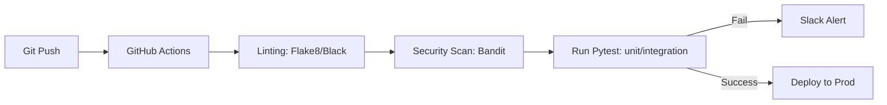

# Bab 10: The Shield: Testing & Security Audit

## Cerita Di Balik Layar
Seorang engineer senior pernah berkata: *"Kode yang tidak dites adalah kode yang sudah rusak, Anda hanya belum mengetahuinya saja."* Dalam sistem seperti SovereignDrive AI yang menangani data sensitif dan enkripsi tingkat tinggi, kesalahan satu baris kode (seperti salah mengetik variabel Nonce) bisa menyebabkan ribuan file tidak bisa dibuka selamanya.

Dalam bab penutup ini, kita akan membangun "Perisai" (The Shield). Kita akan belajar bagaimana menggunakan **Pytest** untuk memastikan bahwa setiap gerendel keamanan yang kita bangun di bab-bab sebelumnya berfungsi dengan sempurna dan tidak akan jebol saat kita melakukan update di masa depan.

---

## 10.1. Arsitektur QA Modern dengan Pytest

Untuk proyek Django modern, **Pytest** adalah standar industri. Dibandingkan dengan `unittest` bawaan Django, Pytest menawarkan ekosistem yang lebih kuat.

### 10.1.1. Kekuatan Fixtures
Fixtures memungkinkan kita menyiapkan data test secara modular. 
*Contoh:* Anda tidak perlu menulis kode pembuatan user di setiap fungsi test. Cukup buat satu fixture `user_with_files` dan panggil di mana pun dibutuhkan.

### 10.1.2. Automasi CI/CD Pipeline
Di dunia profesional, test dijalankan otomatis setiap kali Anda melakukan `git push`.


---

## 10.2. Pengujian Kriptografi: Integritas Tanpa Celah

Test yang paling krusial adalah memastikan bahwa data yang dienkripsi bisa dikembalikan menjadi data asli tanpa cacat satu bit pun.

### 10.2.1. Negative Testing (Fuzzing)
Jangan hanya mengetes alur sukses. Kita harus mencoba merusak sistem:
```python
def test_decryption_with_corrupted_nonce():
    """Memastikan sistem menolak data jika Nonce dimodifikasi."""
    encrypted_blob = list(encrypt_stream(input_stream))
    # Sengaja ubah 1 byte pada bagian Nonce
    encrypted_blob[16] = encrypted_blob[16] ^ 0xFF 
    
    with pytest.raises(ValueError, match="Integritas data gagal"):
        list(decrypt_stream(BytesIO(encrypted_blob)))
```

---

## 10.3. Security Testing: Mencegah Kebocoran Data (IDOR)

Kita harus memastikan user A tidak bisa melihat file user B meskipun user A menebak ID file tersebut.

```python
@pytest.mark.django_db
def test_idor_prevention(api_client, user_a, user_b, file_of_user_b):
    api_client.force_authenticate(user=user_a)
    url = f"/api/v1/files/{file_of_user_b.id}/"
    response = api_client.get(url)
    
    # Harus mengembalikan 404 (Not Found) bukan 403 (Forbidden)
    # untuk tidak membocorkan keberadaan file tersebut.
    assert response.status_code == 404
```

---

## 10.4. Audit Keamanan Otomatis (Static Analysis)

Selain pengujian logika, kita menggunakan alat pemindai kode otomatis:
1.  **Bandit**: Mencari celah keamanan umum di Python (seperti penggunaan `os.system` yang berbahaya atau hardcoded password).
2.  **Audit Log Tracking**: Kita memverifikasi bahwa setiap aksi krusial (seperti `download` atau `delete`) benar-benar tercatat di tabel `AuditLog`.

```python
def test_audit_log_creation_on_download(api_client, my_file):
    api_client.get(f"/api/v1/files/{my_file.id}/download/")
    assert AuditLog.objects.filter(action='download', target_id=my_file.id).exists()
```

---

## 10.5. Performance & Load Testing

SovereignDrive harus tetap stabil saat diakses banyak orang.
- **Locust**: Kita menggunakan library ini untuk mensimulasikan 100 user yang mengunggah file secara bersamaan.
- **Goal**: Memastikan worker Celery tidak *crash* dan database tidak mengalami *deadlock*.

---

## 10.6. Common Pitfalls (Lubang Jebakan)

1.  **Testing with Real Media Storage**: Jika Anda menjalankan test 1000 kali, disk server akan penuh dengan file sampah hasil testing. **Solusi**: Gunakan `@override_settings(MEDIA_ROOT=tempfile.gettempdir())`.
2.  **Slow AI Engine Tests**: Jangan memanggil Tesseract asli saat unit testing. Gunakan **Mocking** untuk memberikan respons teks palsu agar test berjalan dalam milidetik, bukan detik.
3.  **Database Leaks**: Lupa membersihkan database antar test. Gunakan decorator `@pytest.mark.django_db` yang secara otomatis membungkus setiap test dalam transaksi dan melakukan *rollback* di akhir.

---

## 10.7. Melampaui Horizon: Masa Depan Infrastruktur Anda

Apa yang telah kita bangun dalam buku ini adalah sebuah benteng digital yang kokoh (SovereignDrive AI). Namun, dunia teknologi terus bergerak maju secepat kilat. Ubuntu Server yang Anda pelajari hari ini adalah gerbang menuju ekosistem yang jauh lebih luas. 

Jika Anda ingin membawa kemampuan engineering Anda ke level selanjutnya, berikut adalah beberapa cakrawala yang bisa Anda jelajahi setelah menyelesaikan buku ini:

### 10.7.1. Orchestration & Scale (Kubernetes)
Dalam buku ini kita menggunakan Docker Compose, yang sangat bagus untuk satu server tunggal. Namun, bayangkan jika sistem SovereignDrive Anda melayani jutaan pengguna dan memerlukan ratusan server. Di sinilah **Kubernetes (K8s)** berperan. Ia akan mengelola kontainer Anda secara otomatis, menangani penyembuhan diri (*self-healing*) jika ada server yang mati, dan melakukan scaling otomatis.

### 10.7.2. Cloud Native & Multi-Cloud
Meskipun kita fokus pada kedaulatan data, Anda bisa menggabungkan keamanan SovereignDrive dengan fleksibilitas cloud raksasa (AWS, GCP, Azure) menggunakan strategi **Hybrid Cloud**. Mempelajari *Infrastructure as Code* (seperti Terraform atau Ansible) akan memudahkan Anda membangun ribuan server Ubuntu hanya dengan satu baris perintah.

### 10.7.3. Deep Learning & Large-Scale AI
AI yang kita gunakan di sini (Tesseract & NLTK) adalah dasar yang kuat. Langkah selanjutnya adalah melatih model AI Anda sendiri menggunakan **PyTorch** atau **TensorFlow**. Anda bisa membangun sistem pengenalan wajah (Face Recognition) untuk akses login atau chatbot pintar yang bisa menjawab pertanyaan berdasarkan dokumen yang Anda simpan (Retrieval-Augmented Generation / RAG).

### 10.7.4. Cyber Security & Hardening Lanjut
Keamanan adalah perjalanan, bukan tujuan. Anda bisa mendalami teknik *Pentesting* (Penetration Testing) untuk mencoba membobol sistem Anda sendiri, atau mempelajari **Blockchain** untuk menciptakan sistem pencatatan audit (*audit log*) yang benar-benar mustahil untuk dimanipulasi.

---

## Penutup: Kunci Benteng Ada di Tangan Anda

Buku ini mungkin berakhir di sini, tetapi perjalanan Anda sebagai seorang *Sovereign Engineer* baru saja dimulai. Dengan memahami Python, Django, Kriptografi, dan Ubuntu Server, Anda telah mengambil kembali kendali atas privasi dan data Anda.

Teruslah bereksperimen, teruslah mengaudit kode Anda, dan jangan pernah berhenti belajar. Dunia digital yang lebih aman dan berdaulat dimulai dari satu server yang Anda bangun hari ini.

**Sampai jumpa di petualangan engineering selanjutnya!**

---

## ✅ Engineering Checkpoint: Quality Assurance & Security Audit
Sistem yang baik adalah sistem yang teruji secara otomatis dan berkelanjutan:
- [ ] **Data Integrity Tests:** Apakah seluruh alur enkripsi-dekripsi sudah diuji dengan skenario data rusak (corrupted data)?
- [ ] **IDOR & ACL Tests:** Apakah setiap endpoint API sudah diuji dengan user yang tidak memiliki hak akses?
- [ ] **Temporary Storage Override:** Apakah `MEDIA_ROOT` sudah dialihkan ke folder temporary saat testing dijalankan?
- [ ] **Static Security Scanning:** Apakah `Bandit` sudah dijalankan dan mengembalikan skor nol untuk temuan risiko tinggi?
- [ ] **Mocking Strategy:** Apakah library berat (Tesseract/Elasticsearch) sudah menggunakan Mock objek pada level unit test?
- [ ] **CI/CD Workflow:** Apakah file `.github/workflows/main.yml` sudah terkonfigurasi untuk menjalankan seluruh rangkaian test pada setiap push?
